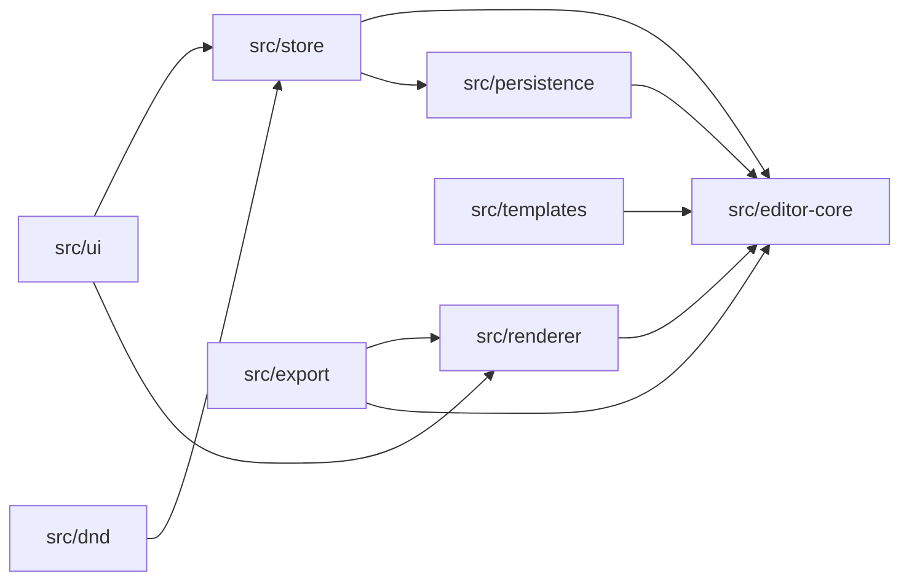
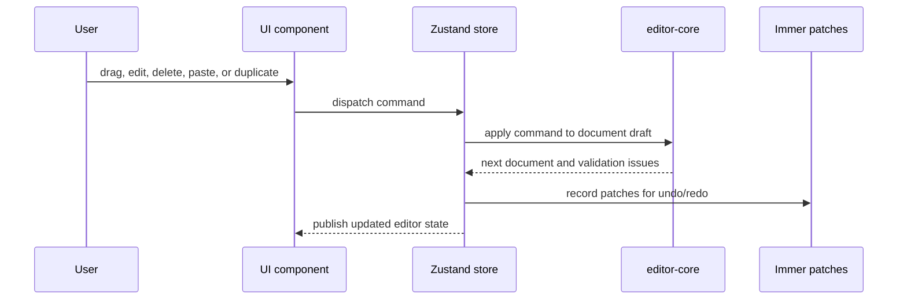

# Page Builder Core

Offline-first React page builder with structured document editing, local persistence, and sanitized JSON/HTML export.


Page Builder Core lets users create pages from templates, drag blocks onto a canvas, edit content and styling, preview layouts, save locally, and export portable output. The project is built as a client-only application, so the core authoring workflow works without a backend.

## Why This Project Exists

Visual page builders are easy to prototype but hard to keep reliable. The important challenge is not only rendering blocks on a canvas; it is keeping the underlying document valid while users drag, duplicate, delete, paste, import, and export content.

This project addresses that with a structured document model and a centralized command pipeline. UI interactions express user intent, but reusable editor-core logic decides whether a document change is valid. That keeps the editor testable and makes import/export safety a first-class part of the architecture.

## Product Highlights

- Create pages from built-in templates.
- Add layout, content, media, icon, and form blocks.
- Drag and drop blocks with validated drop targets.
- Edit page metadata, block props, responsive spacing, typography, and appearance.
- Navigate nested content through a layer tree.
- Save reusable block subtrees in a local component library.
- Switch between edit and preview modes.
- Persist multiple documents in browser LocalStorage.
- Export schema-versioned JSON and sanitized static HTML.


Caption: The template gallery creates a valid starting document instead of leaving users with an empty editor state.

## Quick Start

```bash
npm install
npm run dev
```

Open the Vite URL printed in the terminal.

Useful commands:

```bash
npm run build
npm run typecheck
npm run test:run
npm run test:e2e
npm run lint
npm run format
```

First-time Playwright setup for E2E tests:

```bash
npx playwright install
```

## Architecture At A Glance



The core rule is simple: document logic belongs in `src/editor-core/`, not inside scattered UI components.

| Area                                     | Responsibility                                                                 |
| ---------------------------------------- | ------------------------------------------------------------------------------ |
| [`src/editor-core/`](./src/editor-core/) | Types, block registry, commands, validation, normalization, styles, migrations |
| [`src/store/`](./src/store/)             | Zustand store, selection, history, transactions, clipboard                     |
| [`src/renderer/`](./src/renderer/)       | React rendering for editor, preview, and export modes                          |
| [`src/dnd/`](./src/dnd/)                 | Drop intent calculation and rule checks                                        |
| [`src/persistence/`](./src/persistence/) | LocalStorage, autosave, workspace, import parsing                              |
| [`src/export/`](./src/export/)           | JSON export, HTML export, sanitization, warnings                               |
| [`src/ui/`](./src/ui/)                   | App shell, toolbar, palette, canvas, inspector, dialogs                        |
| [`src/templates/`](./src/templates/)     | Built-in template document factories                                           |

## Key Engineering Decisions

| Decision                  | Why it matters                                                                      | Trade-off                                                                   |
| ------------------------- | ----------------------------------------------------------------------------------- | --------------------------------------------------------------------------- |
| Normalized document graph | Makes move, delete, duplicate, paste, validation, and export easier to reason about | Requires explicit graph helpers and normalization                           |
| Command pipeline          | Keeps every mutation behind one validation and history boundary                     | Adds upfront structure compared with direct state edits                     |
| Patch-based history       | Uses Immer patches for undo/redo instead of full document snapshots                 | Requires careful transaction grouping                                       |
| Runtime schema validation | Zod validates persisted and imported JSON before the editor accepts it              | Types and schemas must stay aligned                                         |
| Style allowlist           | Prevents arbitrary imported style objects from flowing into render/export           | Limits raw CSS freedom                                                      |
| Sanitized HTML export     | Strips unsafe URLs and escapes metadata before generating static HTML               | Export can differ from the editable document when unsafe fields are removed |
| Client-only runtime       | Keeps setup simple and supports offline use                                         | Browser storage has size and security limits                                |

## Document Mutation Flow



Start with these files for a technical review:

- [`src/editor-core/types.ts`](./src/editor-core/types.ts): canonical document and node types.
- [`src/editor-core/registry.ts`](./src/editor-core/registry.ts): block definitions, allowed children, inspector metadata, validation.
- [`src/editor-core/commands.ts`](./src/editor-core/commands.ts): document mutation rules.
- [`src/store/editorStore.ts`](./src/store/editorStore.ts): history, transactions, selection, clipboard, UI commands.
- [`src/export/sanitize.ts`](./src/export/sanitize.ts): export-time URL and hidden-node handling.
- [`src/export/html.tsx`](./src/export/html.tsx): static HTML export shell.

## Import, Export, And Safety

The app treats document portability as a core feature:

- JSON import is size-limited, parsed, migrated, and validated before replacing the current document.
- JSON export preserves the structured document.
- HTML export renders through the React renderer in export mode.
- Unsafe URLs are stripped from export output and reported as warnings.
- Metadata is escaped before being inserted into the HTML shell.
- Arbitrary HTML injection is avoided in the MVP.


Caption: Export supports JSON and static HTML output, with export-specific safety handling.

## Testing And Quality

The repository uses layered tests:

| Layer                  | Evidence                        |
| ---------------------- | ------------------------------- |
| Core document logic    | `src/editor-core/*.test.ts`     |
| Store and history      | `src/store/editorStore.test.ts` |
| Drag and drop rules    | `src/dnd/*.test.ts`             |
| Renderer behavior      | `src/renderer/*.test.tsx`       |
| Persistence and import | `src/persistence/*.test.ts`     |
| Export safety          | `src/export/export.test.ts`     |
| Browser workflows      | `e2e/*.spec.ts`                 |

CI-ready verification gate:

```bash
npm run typecheck
npm run lint
npm run test:run
npm run build
```

Run Playwright E2E tests for workflow-sensitive changes:

```bash
npm run test:e2e
```

There is no backend deployment requirement for the core app. A future CI workflow can use the commands above as the quality gate.

## Public Documentation

The detailed public docs are ordered for different readers:

- [00 Overview](./public-docs/00-overview.md)
- [01 Getting Started](./public-docs/01-getting-started.md)
- [02 Feature Tour](./public-docs/02-feature-tour.md)
- [03 Architecture](./public-docs/03-architecture.md)
- [04 Data Model](./public-docs/04-data-model.md)
- [05 Command And History](./public-docs/05-command-history.md)
- [06 Drag And Drop](./public-docs/06-drag-and-drop.md)
- [07 Persistence, Import, And Export](./public-docs/07-persistence-import-export.md)
- [08 Security](./public-docs/08-security.md)
- [09 Testing And Quality](./public-docs/09-testing-quality.md)
- [10 Extending Blocks](./public-docs/10-extending-blocks.md)
- [11 Limitations And Roadmap](./public-docs/11-limitations-roadmap.md)
- [12 Contributor Guide](./public-docs/12-contributor-guide.md)
- [13 Reviewer Guide](./public-docs/13-reviewer-guide.md)
- [14 Screenshot Catalog](./public-docs/14-image-catalog.md)

## Known Boundaries

- LocalStorage is convenient for offline use, but it is not encrypted and has browser-dependent size limits.
- The app does not include real-time collaboration or user accounts.
- Static HTML export does not include hosting, deployment, analytics, or asset upload infrastructure.
- Remote media URLs are user-provided and should be treated as external content.
- Accessibility can be improved further with a full screen reader audit and stronger keyboard alternatives for drag/drop workflows.

## What I Would Improve Next

- Move larger document and asset storage to IndexedDB.
- Add a CI workflow that runs typecheck, lint, unit tests, build, and selected E2E tests.
- Add more accessibility-focused E2E coverage.
- Extract cleaner CSS classes during HTML export.
- Add import/export support for the local component library.
- Design a plugin API for third-party block registration.
