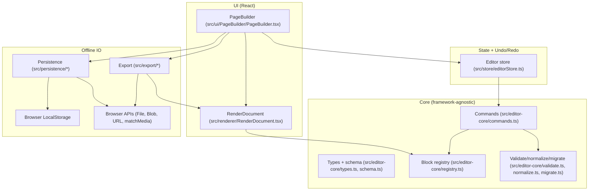
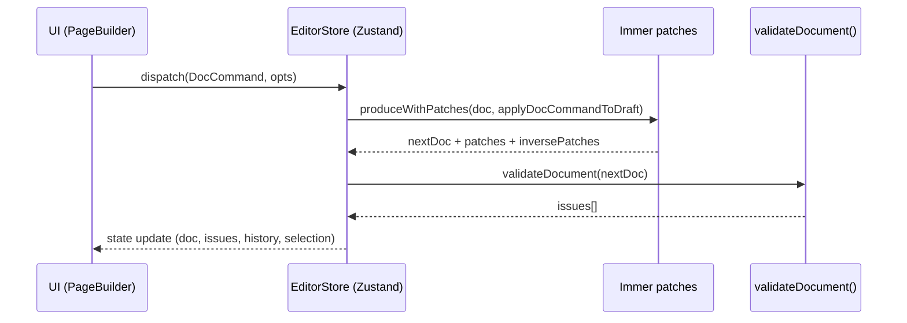

# Page Builder Core - Architecture

This repository implements an offline-first, client-only Page Builder written in React + TypeScript. Users assemble a page from a constrained set of blocks, edit content and styles, preview the result, persist work to LocalStorage, and export to versioned JSON or sanitized HTML.

If you are new to the codebase, read these first:
- `solution.md`: canonical product and implementation specification (data model, DnD rules, safety, export).
- `todos/`: subsystem-level implementation tasks and rationale.

## High-level goals and constraints

**Primary goals**
- Provide a structured block-based editor (not a pixel-perfect design tool).
- Support drag-and-drop composition with clear rule enforcement and feedback.
- Keep a single canonical document format (JSON) with schema versioning.
- Export predictable, sanitized HTML suitable for embedding/publishing.
- Work fully offline at runtime (no backend).

**Non-goals (current)**
- Server sync, collaboration, or multi-user permissions.
- Arbitrary HTML injection or custom code blocks.
- A plugin system for third-party blocks (registry is currently static).

## Repository layout

Top-level:
- `src/`: application source (core logic + UI).
- `e2e/`: Playwright end-to-end tests.
- `todos/`: implementation plan documents per subsystem.
- `solution.md`: canonical spec.
- `dist/`: Vite build output (generated).

Source layout (by subsystem):
- `src/editor-core/`: framework-agnostic core (types, registry, commands, validation, normalization, migrations, id utilities).
- `src/store/`: Zustand store wiring, undo/redo (Immer patches), transactions, clipboard.
- `src/renderer/`: React renderer for editor/preview/export modes.
- `src/dnd/`: drag-and-drop rule checks and intent computation (dnd-kit integration helpers).
- `src/persistence/`: LocalStorage persistence adapter, autosave, JSON import parsing/limits.
- `src/export/`: JSON and HTML export (sanitization, warnings, HTML shell).
- `src/ui/`: application shell UI (toolbar, palette, canvas, inspector, dialogs, keyboard).
- `src/styles/`: global CSS; subsystem CSS is mostly CSS Modules.
- `src/test/`: Vitest setup and helpers.

## Architecture overview

The codebase is split into a small set of layers to keep "core document logic" reusable and testable without React, while the UI stays focused on interaction and rendering.



Key ideas:
- **Single source of truth** is the `Document` JSON model (`src/editor-core/types.ts`), validated by Zod (`src/editor-core/schema.ts`).
- **All document mutations flow through commands** (`DocCommand` in `src/editor-core/commands.ts`) applied via Immer drafts (patches are used for history).
- **Renderer is shared** between editor, preview, and export: HTML export reuses the same React render tree rendered to static markup.
- **Safety is built-in**: URL-like props are sanitized/validated and HTML export removes unsafe URLs.

## Data model

### Document shape

The document is a normalized graph:
- `rootId`: the Page node id.
- `nodes`: a `Record<NodeId, Node>` where each node stores `parentId` and an ordered `children` list.

Core types live in:
- `src/editor-core/types.ts` (TypeScript types)
- `src/editor-core/schema.ts` (runtime validation via Zod)

```ts
export type Document = {
  meta: DocumentMeta;
  theme: Theme;
  rootId: NodeId;
  nodes: Record<NodeId, Node>;
};
```

Why normalized?
- Enables O(1) node lookup by id.
- Makes reparenting/reordering explicit and patch-friendly for undo/redo.
- Keeps import/export stable and avoids deep nested edits in UI code.

### Node shape and invariants

All nodes share common fields:
- `id`: stable identifier.
- `type`: discriminant (e.g., `"text"`, `"image"`, `"container"`).
- `parentId`: `null` for root, otherwise points to a parent node.
- `children`: ordered list of child node ids.
- `constraints`: optional behavioral flags (locked/hidden/draggable/deletable/droppable).
- `style`: optional responsive style buckets (`base`, `sm`, `md`, `lg`).
- `props`: type-specific content properties (discriminated by `type`).

Important graph invariants (enforced by commands, validated by `validateDocument`):
- Root node exists and is a `page`.
- `parentId` and `children` relationships are consistent.
- Leaf node types do not have children.
- Child node types match the allowlist of the parent node type.

### Constrained hierarchy

The editor intentionally constrains the layout hierarchy to keep DnD and export predictable:

- `page`
  - children: `section[]`
- `section`
  - children: exactly one `columns` (enforced)
- `columns`
  - children: `column[]` (count managed by `columns.props.columns`, 2-6)
- `column` / `container`
  - children: content blocks and containers
- leaf blocks: `text`, `image`, `button`, `spacer`, `divider`

The constraint rules and defaults are centralized in the block registry (`src/editor-core/registry.ts`).

## Block registry (single source of truth)

`src/editor-core/registry.ts` defines a `blockRegistry` entry for every node type:
- `defaultProps` and optional `defaultStyle`
- allowed child types and static child constraints
- inspector form schema (drives UI)
- type-specific validation (e.g., URL safety, required fields)

This registry is used by:
- the renderer (labels, semantics)
- DnD rules (`src/dnd/canDrop.ts`)
- commands (structural constraints, managed columns behavior)
- inspector UI (generates content forms from the schema)
- document validation (`src/editor-core/validate.ts`)

Design trade-off:
- Registry-centric design reduces duplication and keeps the UI generic.
- It also means adding a new block requires touching multiple aspects in one place (registry + renderer switch + tests).

## Command and mutation pipeline

### DocCommand (command pattern)

All document mutations are expressed as `DocCommand` in `src/editor-core/commands.ts`, for example:
- `ADD_NODE`, `MOVE_NODE`, `DELETE_NODE`, `DUPLICATE_NODE`
- `UPDATE_PROPS`, `UPDATE_STYLE`, `RESET_STYLE_BREAKPOINT`
- `SET_COLUMNS` (special handling: columns children are managed)
- `INSERT_SUBTREE` (clipboard and import-merge)

Commands are applied in two places:
- `src/editor-core/commands.ts`: framework-agnostic `applyCommand` convenience function (validates after applying).
- `src/store/editorStore.ts`: store-integrated application via `applyDocCommandToDraft` inside `produceWithPatches` (records patches for history).

### Why Immer patches?

Undo/redo is implemented via Immer patches (`immer/produceWithPatches`):
- Each document change yields `patches` and `inversePatches`.
- Undo applies `inversePatches`; redo applies `patches`.
- Transactions group multiple commands into one history entry (DnD uses this).
- Coalescing merges rapid repeated edits (typing) into one history entry.

This gives:
- deterministic undo/redo for structural edits
- small, composable history entries without deep manual diffing

### Store responsibilities

The editor store in `src/store/editorStore.ts` owns:
- the current `doc` and current `issues` (`validateDocument`)
- editor UI state: `mode`, `breakpoint`, `selectedId`, `hoveredId`
- history: `undoStack`, `redoStack`, active transaction
- clipboard: subtree copy/cut/paste

The store also centralizes selection semantics after structural changes:
- After add/duplicate/insert, selection moves to the created node.
- After delete, selection chooses next sibling, previous sibling, or parent.



## Rendering (editor, preview, export)

Rendering is centralized in `src/renderer/RenderDocument.tsx`.

Modes:
- `editor`: shows selection/hover chrome and drag handles, sets `data-node-id`/`data-node-type` attributes, and (optionally) enables dnd-kit wrappers.
- `preview`: renders the same document without editor chrome; links can be blocked via `disableNavigation`.
- `export`: same as preview, intended for static markup generation; no editor attributes.

Styling:
- Theme is mapped to CSS variables (`themeToCssVars` in `src/renderer/renderUtils.ts`).
- Node styles are allowlisted by key (`STYLE_KEYS` in `src/editor-core/style.ts`) and resolved per breakpoint (`resolveResponsiveStyle`).
- Only values for allowlisted style properties are passed through to React style objects (`stylePropsToCss`).

Security note:
- Rendering never uses `dangerouslySetInnerHTML`.
- Text content is rendered as plain strings.
- URL-like props (`image.src`, `image.linkTo`, `button.href`) are checked with `isProbablySafeUrl` before being used.

## Drag and drop (dnd-kit)

DnD responsibilities are split:
- `src/renderer/RenderDocument.tsx`: integrates dnd-kit `useDraggable` and `useDroppable` in editor mode and tags DOM nodes with `data-node-id` for hit testing.
- `src/dnd/*`: computes drop intent and validates rule constraints without React.
- `src/ui/PageBuilder/PageBuilder.tsx`: owns DndContext wiring, sensors, announcements, drop indicators, and dispatches store commands on drop.

Key concepts:
- Drag ids are encoded strings (`src/dnd/dndIds.ts`):
  - palette drag: `palette:<nodeType>`
  - node drag: `node:<nodeId>`
  - container drop: `container:<nodeId>`
- `canDrop` (`src/dnd/canDrop.ts`) enforces the same structural rules as commands:
  - child allowlists from the registry
  - "managed columns" rules (columns are not freely insertable)
  - cycle prevention (`wouldCreateCycle`)
  - locked/draggable/droppable flags
- `computeDropIntent` (`src/dnd/computeIntent.ts`) computes:
  - the candidate parent container
  - the insertion index based on pointer position
  - axis (`x` vs `y`) for columns depending on breakpoint (stack vertically on small breakpoints)

DnD drop execution:
- Palette drops create a subtree (`buildPaletteSubtree`) and insert it via `INSERT_SUBTREE`.
- Node moves dispatch `MOVE_NODE`.
- DnD operations are wrapped in store transactions to create one undo entry.

## Persistence (offline-first LocalStorage)

Persistence code lives in `src/persistence/`.

### LocalStorage adapter

`src/persistence/localStorage.ts` defines:
- key scheme:
  - primary: `pb:doc:<docId>`
  - backup: `pb:doc:<docId>:backup`
- safe wrappers around LocalStorage to avoid hard failures in restricted environments
- backup rotation on save (best-effort)
- recovery behavior:
  - if primary is corrupt, try backup (except for future schema versions)
  - for future schema versions, refuse to load primary to avoid destructive downgrade

### Import parsing and safety limits

`src/persistence/parseDocument.ts`:
- parses raw JSON text
- applies size limits:
  - `MAX_DOCUMENT_JSON_CHARS`
  - `MAX_DOCUMENT_NODES`
- runs schema version migration (`migrateToLatest`) then normalization (`normalizeDocument`)

### Autosave controller

`src/persistence/autosave.ts`:
- subscribes to `store.doc` changes
- debounces writes (default 600ms)
- blocks autosave if a quota error is detected, until explicitly reset (UI provides "clear saved" flow)

UI integration (in `src/ui/PageBuilder/PageBuilder.tsx`):
- loads the saved doc on startup (`loadFromLocalStorage`)
- starts autosave with status reporting to the toolbar
- provides recovery dialogs when saved data is invalid or in a future schema version

## Import and export

Export code lives in `src/export/`.

### JSON export (canonical)

`exportDocumentToJson` (`src/export/json.ts`) pretty-prints the current `Document` as the canonical representation.

### HTML export (sanitized)

`exportDocumentToHtml` (`src/export/html.tsx`):
- sanitizes the document for export (`sanitizeDocumentForHtmlExport`)
  - removes unsafe URLs (sets them to empty strings)
  - collects warnings (hidden nodes excluded, unsafe URL removals)
- renders the document using the same `RenderDocument` component in `export` mode
- uses `react-dom/server` (or `react-dom/server.browser` when available) to produce static markup
- can return either:
  - a full HTML document shell (`mode: "full"`)
  - a snippet (`mode: "snippet"`)

Design trade-off:
- Rendering HTML via React keeps preview/export consistent.
- It also means export output is constrained to what the renderer supports (no custom templates without updating the renderer).

## Styling and responsive behavior

The styling system is intentionally minimal:
- Theme drives a small set of CSS variables for colors, typography, and spacing (`themeToCssVars`).
- Node styling is stored as responsive buckets (`base`, `sm`, `md`, `lg`) and resolved by cascade order.
- Only allowlisted style properties are persisted and applied (prevents arbitrary style injection from untrusted imports).

Inspector style UI (`src/ui/PageBuilder/PageBuilder.tsx`) supports:
- breakpoint-specific edits with inherited previews
- per-breakpoint reset
- token entry via datalist suggestions (spacing and theme tokens)

## UI shell and interaction model

The main UI is implemented as a single app shell component:
- `src/ui/PageBuilder/PageBuilder.tsx`

Major UI elements:
- Toolbar: mode toggle (edit/preview), breakpoint selector, undo/redo, import/export, autosave status, reset.
- Palette: list of blocks (click to insert, or drag handle to DnD).
- Canvas: renders `RenderDocument`; supports selection, hover, and DnD indicators.
- Inspector: content and style tabs, generated from the registry schema.
- Dialogs: import/export, keyboard shortcuts, reset confirmation, recovery flows.
- Toasts: transient notifications for errors and actions.

Keyboard shortcuts:
- Implemented in `src/ui/keyboard/shortcuts.ts`.
- `PageBuilder` listens globally (capturing) and suppresses shortcuts when typing in inputs/textareas/contenteditable.
- Preview mode is read-only; most shortcuts are disabled except Escape and toggle mode.

Accessibility:
- DnD announcements and screen reader instructions are wired via dnd-kit accessibility hooks.
- Modals and drawers implement basic focus trapping.

## Validation, normalization, and migrations

### Validation

`src/editor-core/validate.ts` performs:
- graph integrity checks (parent/children consistency)
- allowlisted child type checks
- static child constraints (exact/min/max)
- registry-provided type-specific checks

The UI surfaces issues:
- toolbar summary (errors/warnings counts)
- inspector panel issue list with "jump to node" behavior

### Normalization

`src/editor-core/normalize.ts` repairs common corruption patterns on import:
- removes orphans and missing child references
- resolves multi-parent children to a single parent
- enforces the constrained hierarchy:
  - Page has at least one Section
  - Section has exactly one Columns child (creates if missing)
  - Columns children match the `columns` count (adds/merges/removes Column nodes)
  - leaf nodes cannot have children

Normalization reports warnings via an optional callback (`reportIssue`).

### Migrations

`src/editor-core/migrate.ts`:
- reads `meta.schemaVersion`
- rejects future versions
- applies a migration chain to reach `LATEST_SCHEMA_VERSION`
- currently ships with an empty migration list (`MIGRATIONS: []`), so versions older than `1.0.0` are treated as unsupported

Future improvement: add explicit migrations as the schema evolves and include migration tests.

## Infrastructure and tooling

Build and dev tooling:
- Vite (`vite.config.ts`) for dev server and production build.
- TypeScript strict mode (`tsconfig.json`) with path alias `@/*` -> `src/*`.
- ESLint (`eslint.config.js`) for TS + React linting.
- Prettier (`.prettierrc.json`) for formatting.

Testing:
- Unit/integration: Vitest + React Testing Library (`vitest.config.ts`, `src/**/*.{test,spec}.{ts,tsx}`).
- E2E: Playwright (`playwright.config.ts`, tests in `e2e/`).

Runtime dependencies (see `package.json`):
- React 19, Zustand, Immer, Zod, dnd-kit, nanoid.

Deployment model:
- The app builds to static assets (`dist/`) and can be hosted on any static hosting (no server required).
- Persistence relies on LocalStorage; cross-device sync is not provided.

## Conventions and coding standards (project-specific)

Notable conventions you will see throughout the codebase:
- Core logic in `src/editor-core/` avoids importing React (keeps it portable and testable).
- Most modules use named exports; `src/*/index.ts` re-export public APIs per subsystem.
- URL-like props must be sanitized via shared utilities (`isProbablySafeUrl`) and are removed on HTML export if unsafe.
- No `dangerouslySetInnerHTML` (security requirement).
- Style props are allowlisted (`STYLE_KEYS`) and applied via `stylePropsToCss` to prevent arbitrary style blobs.
- Import validates with Zod `.strict()` schemas and rejects unknown properties.

## Known limitations and future improvement areas

**Schema evolution**
- `MIGRATIONS` is currently empty, so only schema `1.0.0` is accepted; older versions are rejected as unsupported.

**UI architecture**
- `src/ui/PageBuilder/PageBuilder.tsx` is large and contains many nested UI components; consider splitting into a folder of focused components (toolbar, palette, inspector, dialogs) to improve maintainability.

**Export and sanitization**
- URL sanitization is intentionally conservative (`isProbablySafeUrl`); consider expanding and formalizing URL handling rules (especially for relative URLs and stricter parsing of edge cases).
- HTML export focuses on URL safety and avoids HTML injection by construction; it does not attempt full CSS sanitization beyond style allowlisting.

**Editor features**
- Single selection only; no outliner/tree view or multi-select.
- Limited style system (inline style props only, no class-based styling or advanced layout constraints).
- No plugin system for external block types.

**Persistence**
- LocalStorage quota can be hit; autosave pauses on quota errors and requires user action to resume.
- No cloud sync or multi-document management (current `docId` is hard-coded to `"default"` in the UI).

## How to extend the system

Common extension tasks and where to change code:

**Add a new block type**
1. Add the type to `NODE_TYPES` in `src/editor-core/constants.ts` and update `NodePropsByType` in `src/editor-core/types.ts`.
2. Extend the Zod schema in `src/editor-core/schema.ts`.
3. Add a registry entry in `src/editor-core/registry.ts` (defaults, allowedChildren, inspector schema, validation).
4. Add rendering support in `src/renderer/RenderDocument.tsx`.
5. Add tests in `src/editor-core/*.test.ts` and update any relevant UI tests.

**Add a new command**
1. Extend `DocCommand` in `src/editor-core/commands.ts`.
2. Implement the draft mutator in `applyDocCommandToDraft`.
3. Update `defaultHistoryLabel` in `src/store/editorStore.ts` if it should have a friendly label.
4. Add tests in `src/editor-core/commands.test.ts` and/or `src/store/editorStore.test.ts`.

**Add a migration**
1. Add a migration entry to `MIGRATIONS` in `src/editor-core/migrate.ts`.
2. Add tests that exercise older raw JSON to latest normalized `Document`.
3. Consider adding UI messaging when migration occurs (UI already displays "Migrated document from schema X" when reported by persistence).

