# Implementation Mermaid Diagrams

This file contains presentation-ready Mermaid diagrams for the Page Builder Core implementation. The diagrams are based on the explanation pack in `project-explanation/implementation-explanation-2026-05-13/` and the main implementation folders under `src/`.

The goal is not to draw every component. The goal is to make the most important implementation ideas easy to explain: the page is a structured document graph, the registry centralizes block rules, commands protect mutations, the shared renderer prevents preview/export drift, persistence is recoverable, and HTML export is sanitized.

## 1. Offline-First Layered Architecture

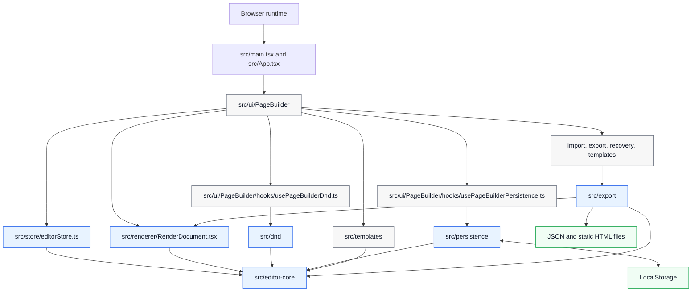

This diagram explains the whole repository as a client-only system. The browser loads a small React entry point, and the real product experience is composed in `src/ui/PageBuilder`. The UI shell coordinates panels, dialogs, drag-and-drop, templates, the canvas, and the inspector, but it does not own the document rules.

The important boundary is `src/editor-core`. The store, renderer, drag-and-drop rules, persistence, templates, and export all depend on core concepts such as `Document`, `Node`, the block registry, validation, graph helpers, migrations, style helpers, and commands. That makes the core logic testable without React and keeps the page builder from becoming only a collection of UI components.

The offline-first constraint is visible on the right side. Runtime persistence goes to LocalStorage, not a backend. Export produces JSON or static HTML files. The architecture supports a static deployment because import, edit, preview, save, recover, and export all happen in the browser.

## 2. Structured Document Graph As The Source Of Truth

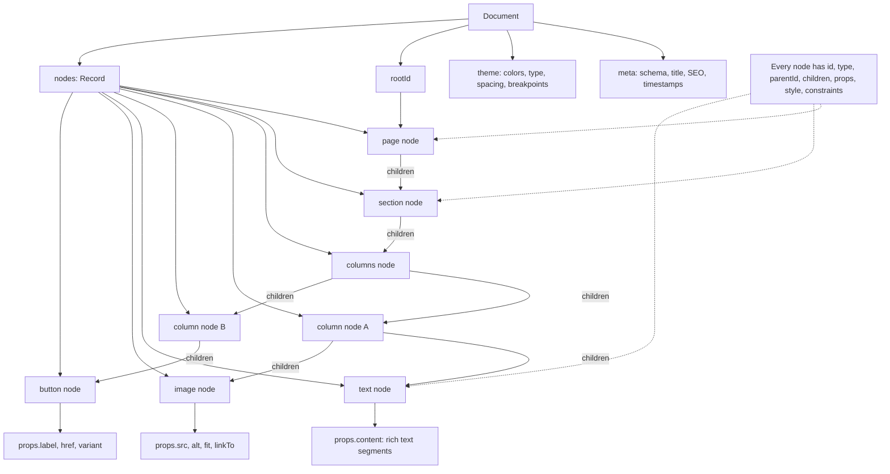

The strongest design choice is that the page is not stored as raw HTML. The source of truth is a typed, versioned JSON document. HTML is only an output format created later by the export pipeline.

The graph is normalized: all nodes live in one `nodes` map, and relationships are expressed through `parentId` and ordered `children` arrays. This is why moving a block can be implemented as updates to a few references instead of rewriting a deeply nested object. It also makes copy, paste, delete, duplicate, import merge, validation, and rendering easier to reason about.

The tradeoff is that normalized graphs need integrity rules. The app must ensure that the root exists, parent-child links agree, children are allowed by the registry, leaf nodes have no children, sections have the required layout child, columns have matching column children, and moves do not create cycles. Those invariants are protected by schema validation, semantic validation, normalization, DnD preflight checks, and command-layer checks.

## 3. Block Registry As The Central Contract

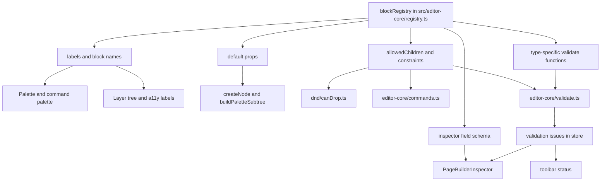

The block registry is the central catalog for what each block type means. It describes labels, defaults, allowed children, constraints, inspector fields, and custom validation. This prevents the same rules from being duplicated across the palette, inspector, validation, drag-and-drop, and node creation code.

For example, `section` allows a `columns` child and requires exactly one child. `columns` allows only `column` children and validates that the number of children matches `props.columns`. Media and form blocks contain URL and field validation. Those facts are not scattered through every UI surface.

This is also a good diagram for explaining extensibility. Adding a new block is not only adding a React render case. A serious block needs a node type, TypeScript props, Zod schema, registry entry, default factory behavior, renderer behavior, inspector fields, validation rules, and tests. That extra structure is the price paid for consistency.

## 4. Command Pipeline From User Intent To Re-Render

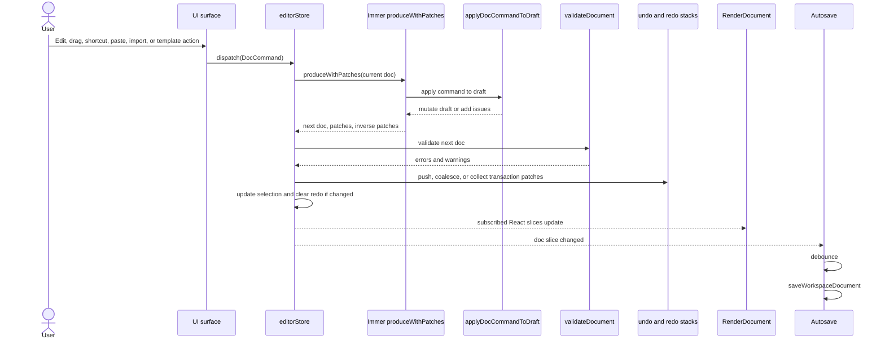

This sequence shows why the UI does not directly edit `doc.nodes`. Any document change is described as a command such as `INSERT_SUBTREE`, `MOVE_NODE`, `DELETE_NODE`, `UPDATE_PROPS`, `UPDATE_STYLE`, `SET_COLUMNS`, `UPDATE_THEME`, or `UPDATE_META`.

The store applies commands with Immer. Immer lets the command implementation write to a draft document, then returns an immutable next document plus forward and inverse patches. The store validates the next document, records history, updates selection, and lets React subscribers re-render.

The practical advantage is consistency. A drag action, an inspector edit, a keyboard shortcut, paste, and import merge all converge on the same mutation pipeline. If a move would break a required section layout or create a cycle, the command layer can reject it no matter which UI surface tried it.

## 5. Undo, Redo, Transactions, And Coalescing

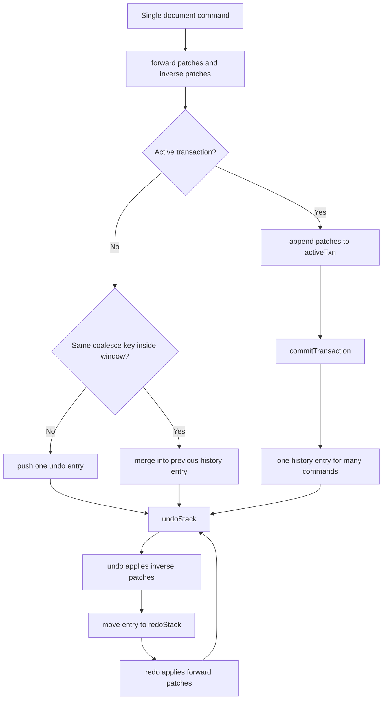

Undo and redo are patch-based. A history entry stores the label, forward patches, inverse patches, timestamp, and optional coalescing key. Undo applies inverse patches to the current document and moves the entry to the redo stack. Redo applies forward patches and moves it back.

Transactions and coalescing solve two different usability problems. Transactions group multiple commands that belong to one user action, such as paste, cut, multi-delete, duplicate multiple nodes, or DnD insert. Coalescing merges rapid edits to the same field, such as inspector typing or slider changes, into one history entry.

This is an important implementation point because undo is not just a convenience feature. In a visual editor, undo makes experimentation safe. The implementation also avoids writing a custom reverse operation for every command type because Immer already supplies inverse patches.

## 6. Drag-And-Drop Intent Pipeline

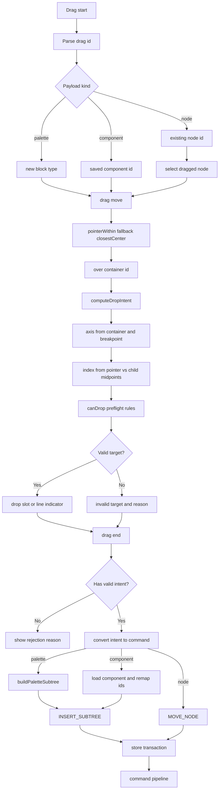

dnd-kit provides sensors, drag events, collision detection, overlays, keyboard support, and accessibility announcements. The repository adds page-builder-specific intelligence on top: what is being dragged, which container is under the pointer, what insertion index should be used, whether the target accepts the dragged type, and what command should run on drop.

`computeDropIntent` converts pointer position into a parent ID, index, and axis. The axis is responsive: a `columns` container uses horizontal insertion at `md` and `lg`, but vertical insertion at `base` and `sm` because columns stack on smaller breakpoints. The insertion index comes from comparing the pointer coordinate to child midpoints.

`canDrop` gives immediate user feedback, but it is not the final safety layer. The command implementation still checks structural constraints at mutation time. This defense-in-depth approach lets the UI guide users during dragging while the core command layer protects document correctness.

## 7. Import, Migration, Normalization, And Recovery

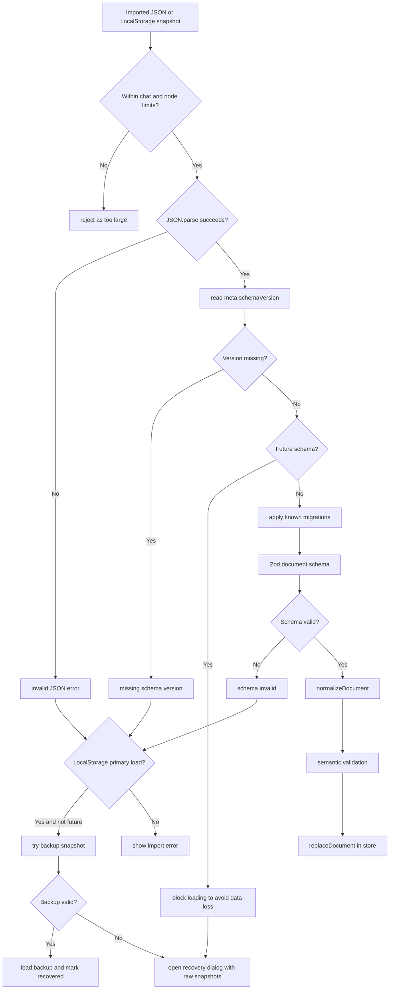

Loading a document is intentionally more conservative than `JSON.parse`. The parser rejects overly large JSON and oversized node maps before migration. Migration handles known schema transitions, such as converting older text props into rich text content. Zod validates runtime shape, and normalization repairs recoverable graph problems into a canonical structure.

The recovery path is specific to LocalStorage. If the primary snapshot is corrupt and it is not a future unsupported schema, the app tries the backup snapshot. If the backup works, the document can be loaded and marked as recovered. If both fail, the UI can expose raw primary and backup text for manual recovery.

Future schema versions are treated differently. The app blocks them because older code might destroy newer data if it tried to load and rewrite it. That is a conservative data-safety choice and a useful point to explain in a presentation.

## 8. Shared Renderer For Editor, Preview, And Export

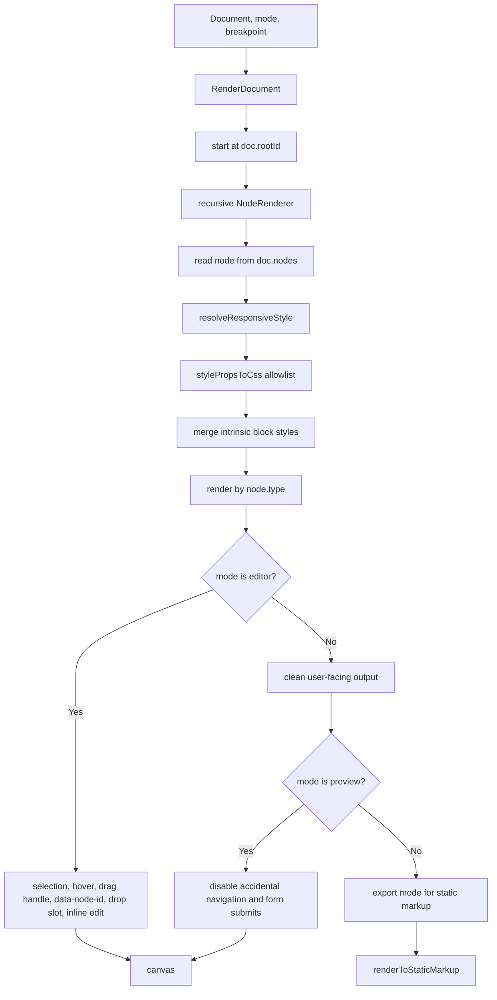

The same renderer supports editor, preview, and export modes. This is one of the strongest architectural decisions because it reduces drift. The app does not maintain one implementation for the editable canvas, another for preview, and another for export.

Editor mode adds editor-only behavior: selection outlines, hover state, drag handles, DnD data attributes, hidden badges, drop slots, context menu support, and inline text editing. Preview mode removes editor chrome and behaves more like a user-facing page, while still preventing accidental navigation or form submission when configured. Export mode is rendered to static markup by the HTML export layer.

This diagram is useful for explaining why the app does not export `canvas.innerHTML`. The editor canvas contains editor-specific DOM. Export instead renders the validated document in export mode, which keeps editor artifacts out of the final HTML.

## 9. Responsive Style Resolution And Theme Tokens

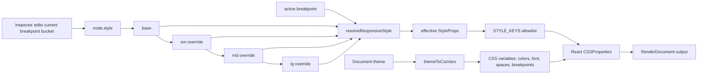

Responsive styles are stored as a base style plus optional `sm`, `md`, and `lg` overrides. The renderer resolves the effective style by cascading from base up to the active breakpoint. For example, `lg` means base plus `sm`, plus `md`, plus `lg`.

The inspector edits the current breakpoint bucket instead of overwriting the whole style object. That lets users set a base value and then override only what changes at a larger breakpoint. If an override value is removed, the command layer deletes that key and cleans empty style buckets.

The allowlist is important. `STYLE_KEYS` controls which style properties can be applied and exported. This keeps the style model maintainable and reduces security risk because arbitrary CSS objects are not passed through from imported JSON.

## 10. HTML Export Safety Pipeline

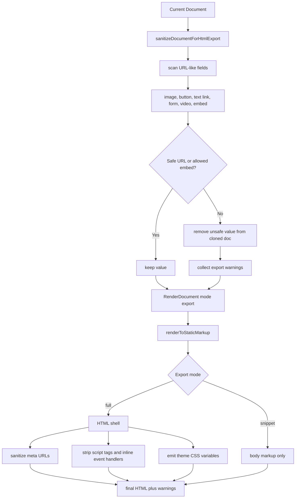

HTML export is deliberately more careful than JSON export. JSON export can simply pretty-print the canonical document because JSON is the editor data model. HTML export creates executable browser content, so it must sanitize risky fields before rendering.

The sanitizer scans URL-like values across images, button links, rich text links, forms, videos, and embeds. General URLs go through `isProbablySafeUrl`; video URLs must parse as YouTube or Vimeo; generic embeds use a stricter domain allowlist. Unsafe values are removed from a cloned document, and warnings are returned so the user knows export changed something.

Full HTML export also builds a document shell with title, metadata, viewport, language, theme CSS variables, and an optional head snippet. Meta URLs are checked again, and the head snippet strips script tags and inline event handlers. This is not a general-purpose arbitrary HTML sanitizer, but it is an intentional defense for the limited head-snippet feature.

## 11. Offline Workspace And Autosave Storage Model

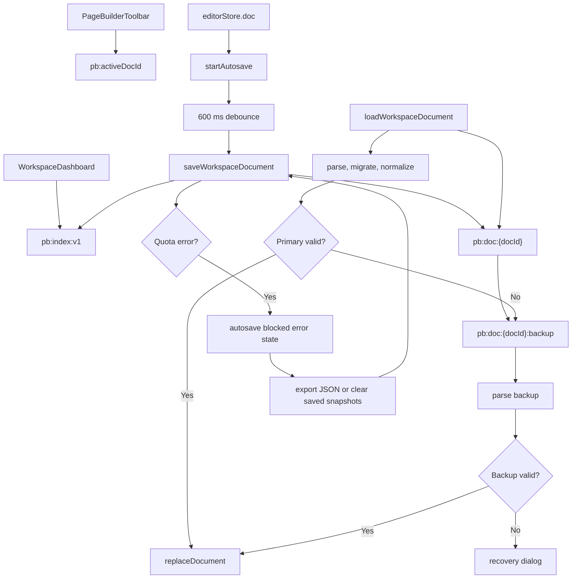

The project is offline-first, but it still treats browser storage as unreliable. Each document has a primary snapshot and one backup snapshot. The workspace index stores document metadata so the dashboard can list pages without scanning every LocalStorage key. The active document ID lets the app reopen the last used document.

Autosave subscribes to only the document slice of the store, debounces writes, saves through the workspace layer, and updates the workspace index. If LocalStorage quota is exceeded, autosave enters a blocked error state instead of pretending that work is saved.

Backup rotation and recovery are important reliability features. When saving a new primary snapshot, the previous primary can become the backup. When loading, the app tries the primary first, then the backup if appropriate. If both fail, recovery UI can expose raw snapshots instead of silently discarding them.

## 12. Test Coverage Mirrors The Architecture

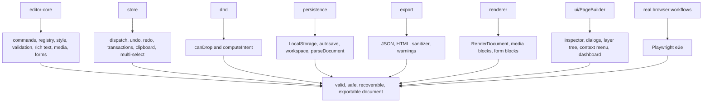

The testing strategy follows the same boundaries as the implementation. Core document behavior is unit-tested because it owns the most important invariants. Store tests verify how commands affect history, selection, clipboard, and transactions. DnD tests cover intent and rule decisions without requiring a browser drag for every case.

Persistence and export tests protect the reliability and security requirements: migration, size limits, backup recovery, quota handling, JSON export, HTML sanitization, hidden-node warnings, unsafe URL removal, and head-snippet stripping. Renderer and UI tests cover DOM output and cross-component behavior.

This diagram is useful in a defense or code walkthrough because it shows that the project is not only tested by clicking around. The most important risks are tested near the layer that owns them, and Playwright covers the browser workflows that unit tests cannot fully simulate.
