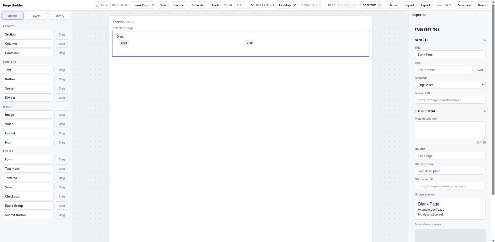

# Page Builder Core

Page Builder Core is an offline-first React page builder. It lets users create pages from templates, drag blocks onto a canvas, edit content and styling, manage local documents, preview responsive layouts, and export the result as JSON or static HTML.

The project is intentionally more than a visual demo. The editor is built around a structured document model, a centralized command pipeline, schema validation, patch-based undo/redo, LocalStorage persistence, and sanitized export. That architecture keeps the page document portable and testable while still supporting a rich visual editing workflow.

Caption: The main editor combines a block palette, document canvas, toolbar controls, breakpoint switching, and a contextual inspector.

## What The App Does

- Creates pages from templates such as blank pages, landing pages, portfolios, blog posts, pricing pages, and coming-soon pages.
- Lets users add layout, content, media, icon, and form blocks.
- Supports drag and drop insertion and movement through dnd-kit.
- Provides an inspector for page metadata, block props, responsive spacing, typography, and appearance.
- Provides a layer tree for navigating the document hierarchy.
- Lets users save reusable block subtrees in a local component library.
- Supports design tokens for colors, typography, and spacing.
- Persists documents locally without a backend.
- Exports documents to schema-versioned JSON and sanitized HTML.

## Why It Is Interesting

Visual editors often look simple from the outside, but they become fragile if UI components mutate arbitrary nested state directly. This project avoids that by treating the page as structured data:

- The document is a normalized graph of nodes.
- Node types and props are defined in `src/editor-core/`.
- UI actions dispatch commands rather than editing nodes ad hoc.
- Commands enforce rules such as allowed children, locked nodes, exact child counts, safe URLs, and managed columns.
- The store records Immer patches for undo and redo.
- Import/export paths validate and sanitize data before accepting or emitting it.

The result is a codebase where the hard rules are independent of the React UI and can be tested directly.

## Technology Stack

| Area                       | Choice                        | Why it fits                                        |
| -------------------------- | ----------------------------- | -------------------------------------------------- |
| UI                         | React 19                      | Component-based editor shell and renderer          |
| Build                      | Vite                          | Fast local development and production builds       |
| Language                   | TypeScript strict mode        | Strong contracts for document and command logic    |
| State                      | Zustand                       | Small store layer with explicit selectors          |
| Immutable updates          | Immer patches                 | Efficient undo/redo and grouped transactions       |
| Drag and drop              | dnd-kit                       | Accessible drag primitives and drag overlays       |
| Runtime validation         | Zod                           | Schema validation for persisted/imported documents |
| Unit and integration tests | Vitest, React Testing Library | Fast feedback for core and UI behavior             |
| E2E tests                  | Playwright                    | Browser-level coverage for critical workflows      |
| Quality                    | ESLint, Prettier              | Consistent code style and static checks            |

## Documentation Map

- [Getting Started](./01-getting-started.md): install, run, build, and test the app.
- [Feature Tour](./02-feature-tour.md): screenshot-led walkthrough of the product.
- [Architecture](./03-architecture.md): module boundaries and runtime flows.
- [Data Model](./04-data-model.md): document graph, node types, props, styles, themes, and schema versioning.
- [Command And History](./05-command-history.md): centralized mutations, undo/redo, transactions, selection, and clipboard behavior.
- [Drag And Drop](./06-drag-and-drop.md): how drag gestures become valid document commands.
- [Persistence, Import, And Export](./07-persistence-import-export.md): LocalStorage, recovery, JSON import/export, and HTML export.
- [Security](./08-security.md): URL safety, style allowlists, import validation, and sanitized export.
- [Testing And Quality](./09-testing-quality.md): test layers and verification commands.
- [Extending Blocks](./10-extending-blocks.md): how to add or change a block type.
- [Limitations And Roadmap](./11-limitations-roadmap.md): current boundaries and future work.
- [Contributor Guide](./12-contributor-guide.md): safe development workflow.
- [Reviewer Guide](./13-reviewer-guide.md): fast evaluation path for technical reviewers.

## Best First Review Path

1. Run the app with `npm install` and `npm run dev`.
2. Create a page from a template.
3. Drag a block onto the canvas and edit it in the inspector.
4. Save, reload, and verify local persistence.
5. Export HTML and inspect the generated page.
6. Read `src/editor-core/commands.ts`, `src/store/editorStore.ts`, and `src/export/sanitize.ts`.
7. Run `npm run typecheck`, `npm run test:run`, and `npm run build`.
