# Feature Tour

This page walks through the product experience before diving into internals. The screenshots show real app states from the current implementation.

## Workspace Dashboard

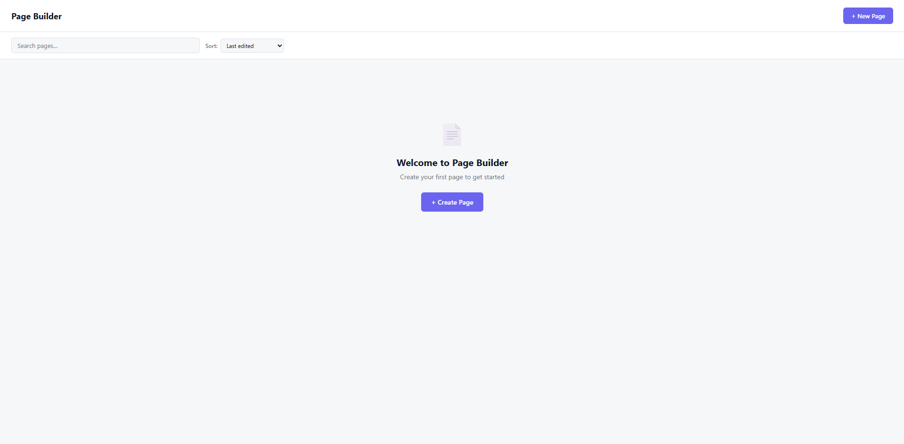

Caption: The workspace dashboard is the starting point for local documents. It supports searching, sorting, and creating a new page.

The app starts from a local workspace rather than a single fixed document. This matters because the editor is designed around offline ownership: a user can create multiple pages, switch between them, duplicate them, delete them, and keep working without a backend.

## Template Gallery

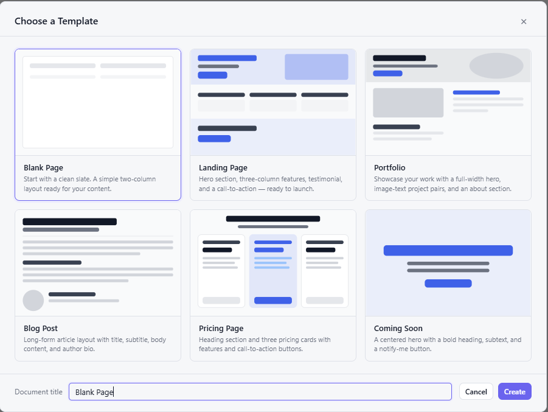

Caption: The template gallery creates a valid initial document graph so users do not have to start from an empty canvas.

Templates provide complete starting structures. Each template produces a document that still goes through the same editor-core rules as manually created content.

## Main Editor Shell

Caption: The editor shell contains global document controls, block palette, central canvas, and the inspector.

The layout is organized around repeated editing tasks:

- The left panel exposes block insertion, layers, and saved components.
- The center canvas shows the current document in edit or preview mode.
- The right inspector edits page settings or selected block fields.
- The toolbar handles document switching, undo/redo, keyboard shortcuts, theme editing, import, export, saving, and reset.

## Drag And Drop Feedback

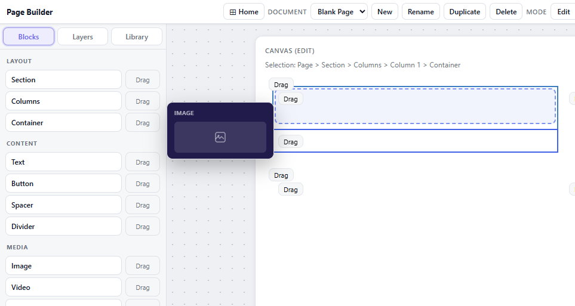

Caption: While dragging an image block, the editor calculates a valid target container and shows the intended insertion region.

Drag and drop is not only visual. The DnD layer computes a drop intent, checks it against document rules, and dispatches a command only if the target is valid.

## Inspector Editing

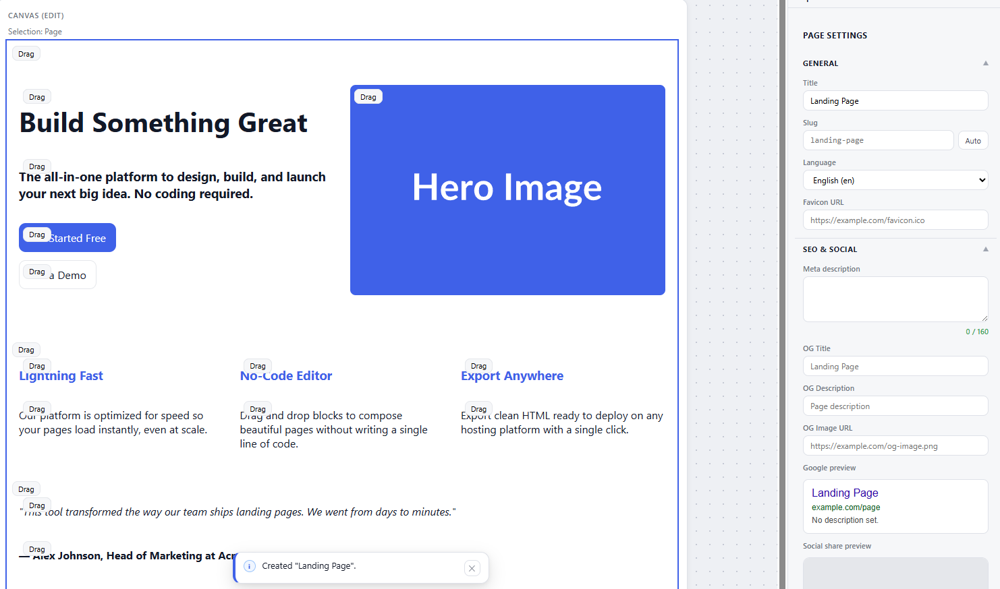

Caption: A generated landing page template can be selected and edited through page settings and block inspectors.

The inspector is contextual. Selecting the page shows SEO and social metadata. Selecting a block shows fields generated from the block registry.

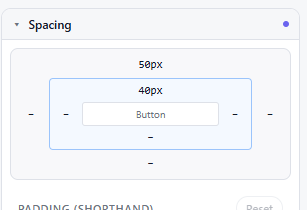

Caption: The spacing editor gives visual feedback for block padding and margin values.

Spacing controls are part of the allowlisted responsive style model. They are stored in the document rather than in scattered component state.

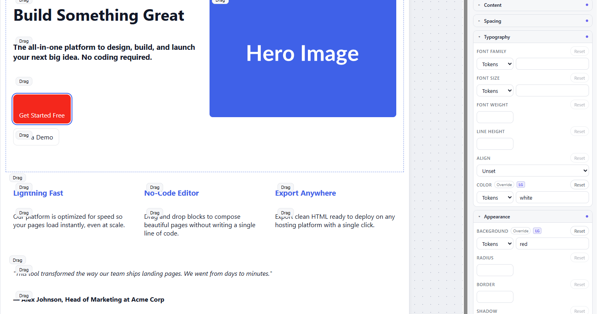

Caption: Typography and appearance controls can override values at the active breakpoint.

The screenshot shows a selected button with typography and appearance fields. The active breakpoint is part of the edit context, so a style can be inherited or overridden.

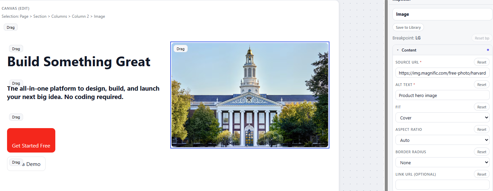

Caption: Image blocks expose source URL, alt text, fit, aspect ratio, border radius, and optional link fields.

Media fields are validated and sanitized during import and export. Unsafe URLs are not allowed to silently become executable HTML.

## Preview Mode

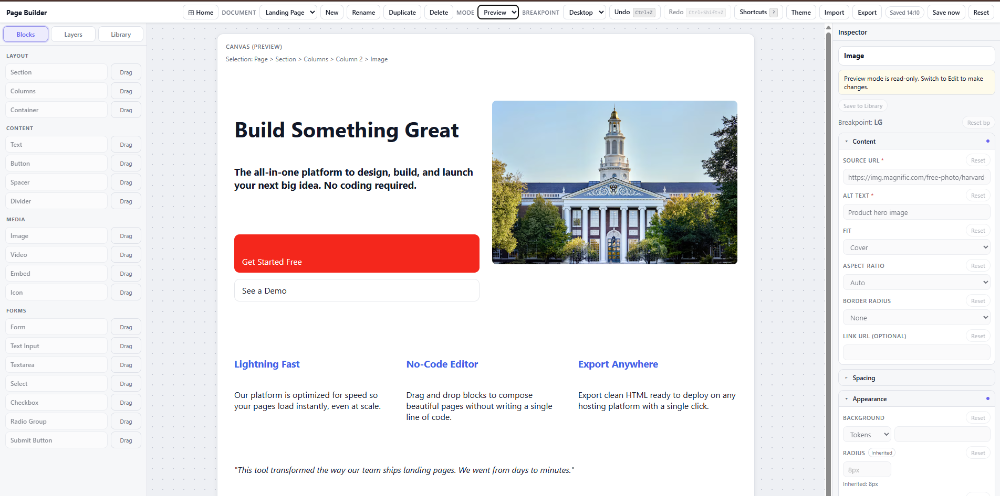

Caption: Preview mode disables editing interactions while rendering the same document structure.

Preview mode lets users inspect the page without editing chrome. The inspector remains visible but read-only, which reinforces that preview is a state of the editor rather than a separate document.

## Export Flow

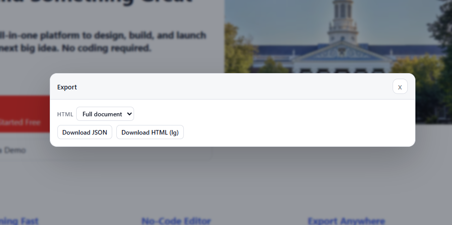

Caption: The export dialog supports JSON and HTML downloads, with HTML available as a full document or snippet.

JSON export preserves the structured document. HTML export renders static markup and applies export-specific sanitization.

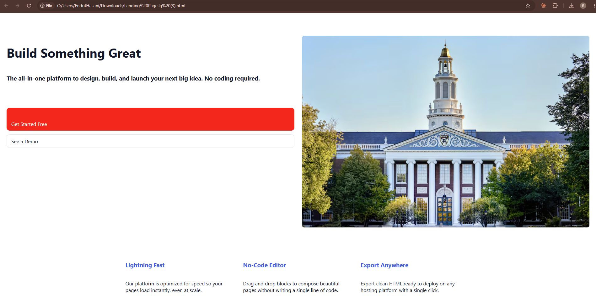

Caption: Exported HTML can be opened as a standalone file and keeps the visible layout without editor chrome.

The exported page is intentionally static. It is suitable for inspection, handoff, or deployment through a separate static hosting workflow.

## Keyboard Shortcuts

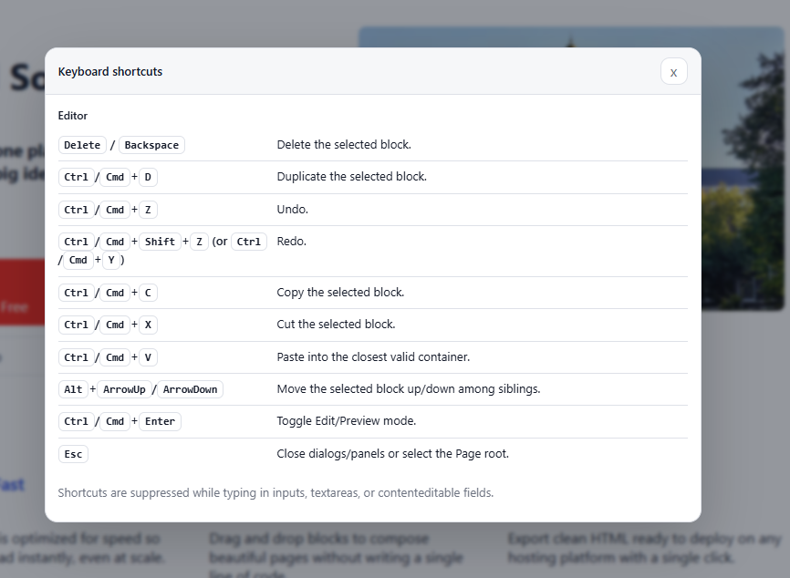

Caption: Shortcut documentation is available inside the app for editing operations such as delete, duplicate, undo, redo, copy, cut, paste, reorder, and mode toggle.

Shortcuts are part of the editor workflow, but they still route through the same store and command logic as toolbar or inspector actions.

## Design Tokens

Caption: Theme controls update colors, typography, and spacing across the document.

Design tokens are stored on the document theme. The renderer converts those values into CSS variables so the canvas, preview, and export paths stay aligned.

## Layer Tree

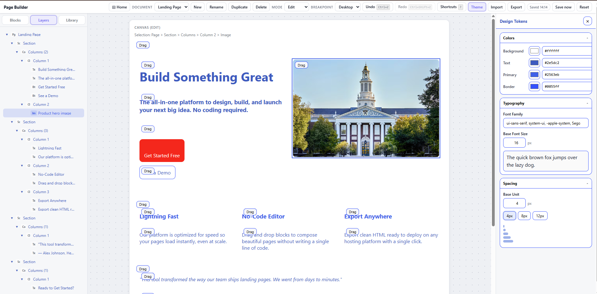

Caption: The layer tree exposes the normalized document hierarchy and lets users navigate nested sections, columns, containers, and blocks.

The layer tree is useful for selecting deeply nested nodes that are difficult to click directly on the canvas.

## Component Library

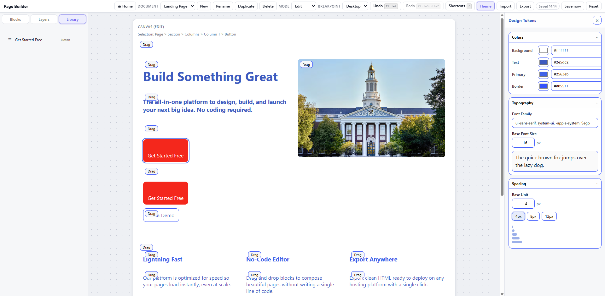

Caption: The component library stores reusable subtrees locally, such as a saved button variant.

Saved components are document subtrees. When pasted or dragged back into the document, their IDs are remapped so they do not collide with existing nodes.

## Responsive Breakpoint Preview

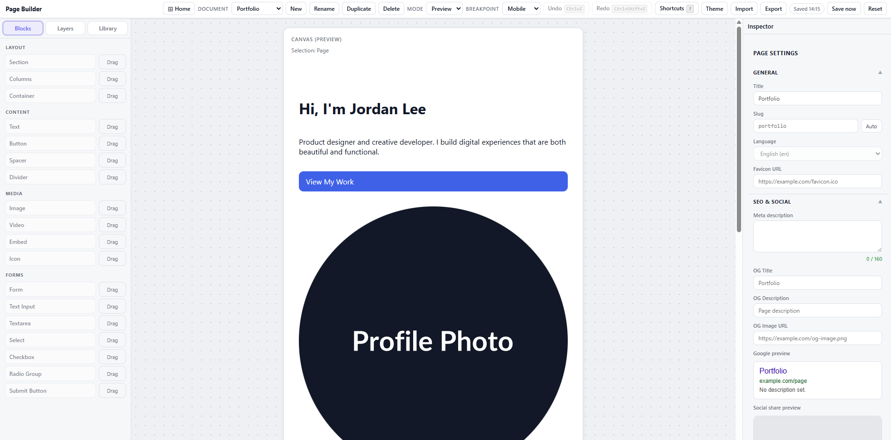

Caption: The editor can preview different breakpoints while keeping document controls visible.

Breakpoint switching affects responsive style resolution and layout behavior. It is also used by drag and drop for layout-specific insert axes.
