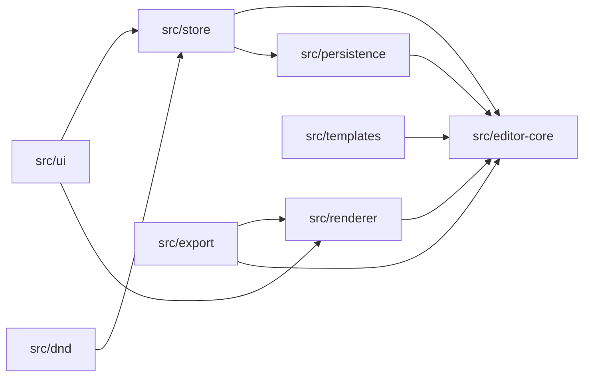
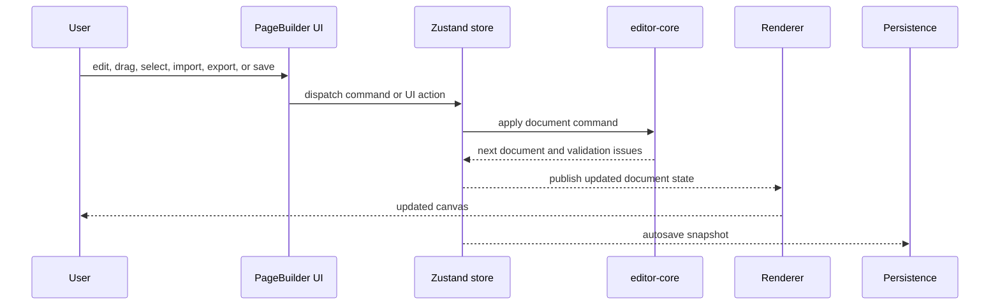

# Architecture

The architecture separates document logic from the React editing surface. That split is the most important design choice in the repository: page-builder behavior remains testable, importable, exportable, and enforceable even when the UI changes.

## Architectural Goals

- Keep document rules framework-agnostic.
- Route document changes through one command pipeline.
- Keep renderer modes consistent for edit, preview, and export.
- Validate imported and persisted documents before accepting them.
- Sanitize exported HTML without weakening the editor model.
- Make critical logic testable without browser automation.

## Module Map

Caption: React-specific editing concerns sit around the core document logic. Import, export, templates, and the store all depend on the same core model.

## Core Layer

`src/editor-core/` owns the reusable page document model:

- Node and document types: `src/editor-core/types.ts`
- Supported node types and schema version: `src/editor-core/constants.ts`
- Runtime document schema: `src/editor-core/schema.ts`
- Block registry and allowed children: `src/editor-core/registry.ts`
- Command application: `src/editor-core/commands.ts`
- Graph helpers: `src/editor-core/graph.ts`
- Normalization and validation: `src/editor-core/normalize.ts`, `src/editor-core/validate.ts`
- Responsive style resolution: `src/editor-core/style.ts`
- Migration path: `src/editor-core/migrate.ts`

This layer should not import React. It is the part of the project that explains what a valid page document means.

## Store Layer

`src/store/editorStore.ts` wraps the core command pipeline in Zustand. It stores:

- The current document.
- Validation issues.
- Edit or preview mode.
- Active breakpoint.
- Selection and hover state.
- Undo and redo stacks.
- Active transaction state.
- Clipboard subtrees.

Document commands produce Immer patches, which are stored for undo and redo. UI-only commands update editor state such as selection, hover, mode, or breakpoint without changing the document.

## Renderer Layer

`src/renderer/` converts the document graph into React output. The same renderer supports multiple modes:

- `editor` mode for editing chrome and selection behavior.
- `preview` mode for read-only visual inspection.
- `export` mode for static HTML generation.

Keeping one renderer path reduces drift between what users edit, preview, and export.

## UI Layer

`src/ui/PageBuilder/` composes the product:

- Toolbar and document controls.
- Palette, layer tree, and component library panels.
- Canvas shell.
- Inspector.
- Dialogs.
- Toasts.
- Guided tour.
- Command palette.
- Keyboard shortcut wiring.

The UI is intentionally orchestration-heavy. It should ask the store to perform changes rather than editing document nodes directly.

## Drag And Drop Layer

`src/dnd/` and `src/ui/PageBuilder/hooks/usePageBuilderDnd.ts` translate pointer gestures into document-safe operations.

The DnD layer computes an intent:

- Which parent should receive the node.
- Which index should be used.
- Which axis applies.
- Whether the source can be dropped there.

Only valid intents become commands.

## Persistence And Export Layers

`src/persistence/` handles local documents, autosave, backup recovery, and JSON import parsing.

`src/export/` handles JSON export and static HTML export. HTML export renders the document through the renderer, but first applies export-specific sanitization and returns warnings for stripped values.

## Runtime Flow

## Why This Design Works

The main benefit is that every feature shares one source of truth. Drag and drop, keyboard shortcuts, inspector edits, component insertion, duplication, paste, and template creation all converge on the same document rules.

That makes the project easier to review:

- To understand valid page structure, read `src/editor-core/registry.ts`.
- To understand document mutation, read `src/editor-core/commands.ts`.
- To understand history and selection behavior, read `src/store/editorStore.ts`.
- To understand rendering output, read `src/renderer/RenderDocument.tsx`.
- To understand export safety, read `src/export/sanitize.ts` and `src/export/html.tsx`.
