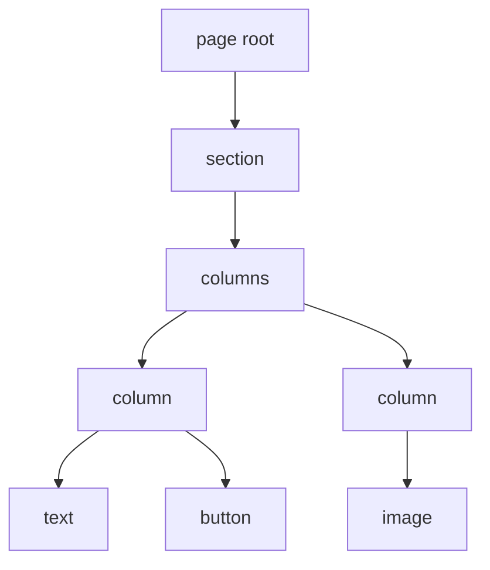
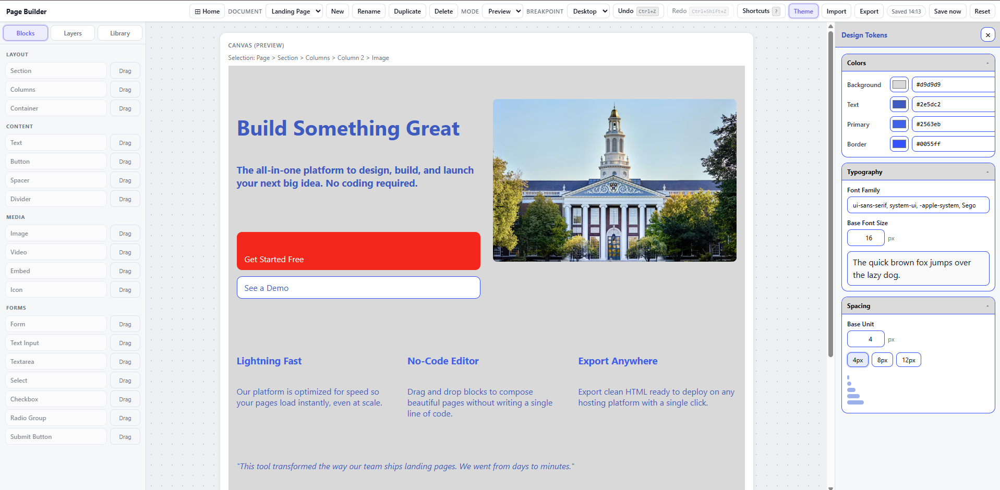

# Data Model

The page is stored as structured data, not as JSX or arbitrary HTML. This is what makes import, export, validation, undo/redo, templates, component reuse, and drag/drop possible.

## Document Shape

The central type is `Document` in `src/editor-core/types.ts`.

At a high level, a document contains:

- `meta`: schema version, timestamps, title, slug, SEO fields, social fields, and optional head snippet.
- `theme`: shared color, typography, spacing, and breakpoint tokens.
- `rootId`: the node ID of the root page node.
- `nodes`: a normalized map of node IDs to nodes.

The current schema version is defined in `src/editor-core/constants.ts`.

## Normalized Node Graph



Caption: The document is stored as a normalized node map. Parent and child IDs define the tree.

Each node includes:

- `id`
- `type`
- `parentId`
- `children`
- `props`
- optional `constraints`
- optional responsive `style`

Normalized storage avoids deeply nested object rewrites and makes operations such as moving, deleting, duplicating, copying, and pasting subtrees easier to reason about.

## Node Types

Supported node types are listed in `src/editor-core/constants.ts`:

| Category        | Node types                                                                               |
| --------------- | ---------------------------------------------------------------------------------------- |
| Root and layout | `page`, `section`, `columns`, `column`, `container`                                      |
| Content         | `text`, `button`, `spacer`, `divider`                                                    |
| Media           | `image`, `video`, `embed`, `icon`                                                        |
| Forms           | `form`, `textInput`, `textarea`, `selectInput`, `checkbox`, `radioGroup`, `submitButton` |

Each node type has a corresponding prop type in `src/editor-core/types.ts` and a runtime schema in `src/editor-core/schema.ts`.

## Block Registry

The block registry in `src/editor-core/registry.ts` connects node types to editor behavior:

- Display label.
- Default props.
- Allowed child types.
- Structural constraints.
- Inspector field definitions.
- Type-specific validation.

For example:

- A `page` can contain `section` nodes.
- A `section` must contain exactly one `columns` child.
- A `columns` node contains managed `column` children.
- A `text` node has rich inline content and no children.
- A `form` can contain form fields and supporting content blocks.

This registry is one of the most important files for understanding how the editor prevents invalid page structures.

## Props

Props are specific to each node type. Examples:

- `PageProps`: title and language.
- `ImageProps`: source URL, alt text, fit, optional link, border radius, aspect ratio.
- `ButtonProps`: label, href, variant.
- `ColumnsProps`: column count and gap.
- `TextProps`: rich inline content, semantic element, optional list type.
- `FormProps`: action URL, method, optional form name.

The TypeScript prop types and Zod schemas should stay aligned. A new field should not be added to one without updating the other.

## Responsive Style Model

Styles are stored as responsive buckets:

```ts
type Responsive<T> = {
  base: T;
  sm?: Partial<T>;
  md?: Partial<T>;
  lg?: Partial<T>;
};
```

Style resolution is mobile-first:

- `base` applies everywhere.
- `sm` overrides `base`.
- `md` overrides `base` and `sm`.
- `lg` overrides all earlier buckets.

The resolver lives in `src/editor-core/style.ts`.

The style model is allowlisted. Only known `StyleProps` keys are accepted by commands and schema parsing. This reduces export risk and keeps the inspector aligned with what the renderer can safely apply.

## Theme

The document theme stores shared tokens:

- Colors: background, text, primary, border.
- Typography: font family, base font size, scale.
- Spacing: base unit.
- Breakpoints: `sm`, `md`, `lg`.

The renderer turns theme values into CSS variables, so canvas rendering and export rendering can share the same visual foundation.



Caption: Theme fields edit document-level tokens rather than isolated component CSS.

## Schema Validation

`src/editor-core/schema.ts` defines strict Zod schemas for:

- Document metadata.
- Theme.
- Node base fields.
- Node constraints.
- Responsive styles.
- Every node type's props.

Strict schemas reject unknown fields. This is important for import safety: imported JSON should become a known document shape or fail with a readable error.

## Migrations

Imports pass through `src/editor-core/migrate.ts`. The parser reads the incoming schema version, migrates known older versions to the latest version, and rejects future versions that this code cannot safely understand.

That gives the project a path to evolve the document model while still keeping exported JSON portable.
