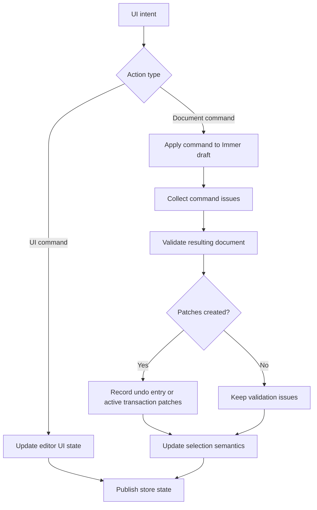

# Command And History

The editor uses a command pipeline for document mutations. This is a deliberate constraint: UI components should express intent, while `src/editor-core/commands.ts` decides whether the document can actually change.

## Why Commands Exist

Without a command layer, each component could edit `doc.nodes` in a slightly different way. That would make undo/redo, validation, import/export, and DnD rule enforcement fragile.

Commands provide one mutation boundary:

- Inspector edits become `UPDATE_PROPS`, `UPDATE_STYLE`, or `UPDATE_META`.
- Palette insertion becomes `ADD_NODE`.
- Dragging existing content becomes `MOVE_NODE`.
- Component insertion becomes `INSERT_SUBTREE`.
- Keyboard actions become delete, duplicate, copy, cut, paste, undo, or redo operations.

## Document Commands

Document commands are defined in `src/editor-core/commands.ts`.

| Command                  | Purpose                                            |
| ------------------------ | -------------------------------------------------- |
| `ADD_NODE`               | Create a new node under a valid parent             |
| `MOVE_NODE`              | Move an existing node to a valid parent/index      |
| `DELETE_NODE`            | Delete a node and its subtree                      |
| `DUPLICATE_NODE`         | Clone and insert a node subtree                    |
| `UPDATE_META`            | Update document metadata                           |
| `UPDATE_PROPS`           | Patch node props                                   |
| `UPDATE_STYLE`           | Patch allowlisted style properties at a breakpoint |
| `RESET_STYLE_BREAKPOINT` | Remove style overrides for one breakpoint          |
| `SET_COLUMNS`            | Change managed column count                        |
| `INSERT_SUBTREE`         | Insert a copied or saved subtree                   |
| `UPDATE_THEME`           | Patch document theme values                        |
| `UPDATE_CONSTRAINTS`     | Patch node constraints                             |

## UI Commands

UI commands live in the store layer because they do not change the document itself:

- `SET_SELECTED`
- `SHIFT_SELECT`
- `SELECT_SIBLINGS`
- `SET_HOVERED`
- `SET_MODE`
- `SET_BREAKPOINT`

This separation keeps undo/redo focused on document changes. Selecting a node should not add an undo entry; editing a node should.

## Command Lifecycle

## Patch-Based History

`src/store/editorStore.ts` uses Immer patches:

- Forward patches apply a document change.
- Inverse patches undo that change.
- Undo moves an entry from `undoStack` to `redoStack`.
- Redo reapplies patches and moves the entry back to `undoStack`.

This is more efficient than storing full document snapshots for every small edit, and it keeps history entries tied to user intents.

## Transactions

Some interactions produce several low-level commands but should feel like one undoable action. The store supports explicit transactions:

- `beginTransaction(label)`
- dispatch one or more commands
- `commitTransaction()`

Examples:

- Multi-node delete.
- Cut selected nodes.
- Paste several copied subtrees.
- Drag/drop operations that need grouped changes.

If a transaction contains no patches, it is discarded.

## Coalescing

The dispatch options support a `coalesceKey` and `coalesceWindowMs`. This lets repeated edits become one history entry when they happen close together, such as rapid typing or repeated style changes.

Coalescing improves undo behavior. The user expects one undo to reverse the meaningful edit, not one character or slider movement at a time in every context.

## Selection Semantics

Selection is updated centrally after commands:

- Adding, duplicating, or inserting selects the created root node.
- Moving keeps the moved node selected.
- Deleting computes a nearby fallback selection.
- Updating props, styles, meta, theme, or columns keeps selection stable when possible.

Centralizing selection avoids UI components inventing inconsistent behavior after mutations.

## Clipboard And Subtrees

Copy and cut store `Subtree[]` values in the editor store. Paste finds a valid target, remaps IDs, and inserts each subtree.

ID remapping is essential. A copied subtree contains node IDs from the original document; inserting it without remapping would collide with existing nodes.

Relevant files:

- `src/editor-core/subtree.ts`
- `src/store/editorStore.ts`
- `src/persistence/componentLibrary.ts`

## Keyboard Shortcuts

Caption: Keyboard shortcuts expose the same core operations as toolbar and inspector controls.

The shortcuts are user-facing convenience, not a separate mutation system. They call store actions and commands, so validation and history behavior remain consistent.

## Tests To Read

- `src/editor-core/commands.test.ts`
- `src/store/editorStore.test.ts`
- `src/ui/keyboard/shortcuts.test.ts`
- `e2e/keyboard.spec.ts`
