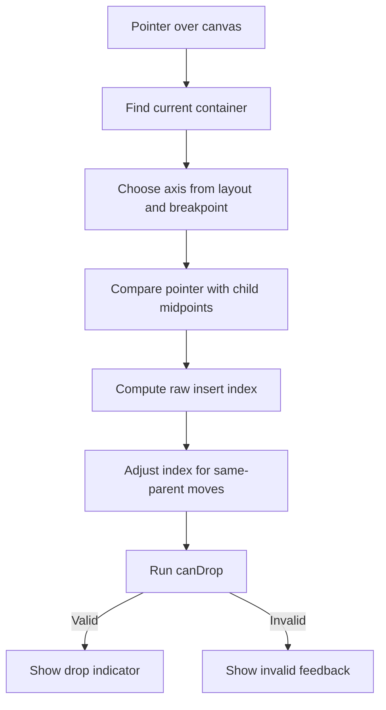

# Drag And Drop

Drag and drop is implemented as a translation layer between pointer movement and validated document commands. It should never be able to corrupt the document tree.

Caption: The editor previews a calculated drop position before dispatching a document command.

## Drag Sources

The editor supports several source types:

- Palette blocks: create a new node from a block type.
- Existing document nodes: move a node.
- Saved components: insert a stored subtree.

These source types are represented as drag payloads in `src/dnd/types.ts`.

## Drop Targets

The DnD logic works with container-like targets in the document. A target is valid only if:

- The target node exists.
- The target can accept dropped children.
- The source node type is allowed under the target node type.
- The operation does not violate structural constraints.
- Moving the node would not create a cycle.
- Managed structures, such as columns, remain valid.

The rule checks live in `src/dnd/canDrop.ts` and are backed by tests in `src/dnd/canDrop.test.ts`.

## Intent Calculation

`src/dnd/computeIntent.ts` computes the drop intent from:

- Current document.
- Active breakpoint.
- Drag source payload.
- Current container under the pointer.
- Pointer coordinates.

The result is either:

- A valid target with parent ID, insert index, target ID, and axis.
- A failure reason for invalid feedback.

## Responsive Axis Behavior

Columns use horizontal insertion on larger breakpoints and vertical insertion on smaller breakpoints. This keeps drag feedback aligned with the visible layout.

For example:

- Desktop columns generally use the `x` axis.
- Base and small breakpoints use the `y` axis when columns stack.

This behavior is handled by `computeDropIntent`.

## Command Dispatch

The DnD hook in `src/ui/PageBuilder/hooks/usePageBuilderDnd.ts` converts a successful intent into the correct document command:

- Palette source: `ADD_NODE`.
- Existing node source: `MOVE_NODE`.
- Component source: `INSERT_SUBTREE`.

The command pipeline still performs core validation. DnD computes intent for feedback and ergonomics, but command application remains the final mutation boundary.

## Invalid Drops

Invalid drops should communicate why the operation cannot happen instead of silently failing. Examples include:

- Dropping a block into a node type that does not allow children.
- Moving the root page node.
- Moving a node into its own subtree.
- Inserting directly into managed `columns`.
- Exceeding a parent's child limit.

## Tests To Read

- `src/dnd/computeIntent.test.ts`
- `src/dnd/canDrop.test.ts`
- `e2e/dnd.spec.ts`
- `e2e/dnd-feedback.spec.ts`

## Design Trade-Off

The DnD layer duplicates some awareness of document structure so it can provide live feedback before the user drops. The core command layer still owns the final rules. This gives users responsive visual feedback without trusting pointer code as the only safety check.
