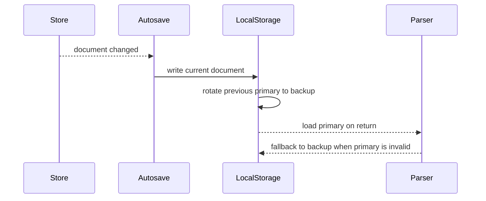

# Persistence, Import, And Export

The app is offline-first. A user can create, save, reload, import, and export pages without a backend service.

## Local Workspace

Caption: The workspace dashboard manages locally saved pages.

The local workspace uses browser LocalStorage. `src/persistence/workspace.ts` manages:

- A workspace index.
- Active document ID.
- Document creation.
- Document duplication.
- Document deletion.
- Loading and saving a selected document.

Each document is stored under a document-specific key. Workspace metadata is stored separately so the dashboard can list local documents without parsing every document body first.

## Autosave And Backup

`src/persistence/autosave.ts` coordinates save behavior. `src/persistence/localStorage.ts` writes the current document and rotates a backup copy when appropriate.

Backup rotation matters because a corrupted primary snapshot should not always destroy the last known usable document. On load, the persistence layer tries the primary document first and can recover from backup when possible.

## Import Path

Imported JSON text is handled by `src/persistence/parseDocument.ts`.

The parser:

1. Rejects text that exceeds the maximum JSON character limit.
2. Parses JSON.
3. Rejects documents that exceed the maximum node count.
4. Reads the incoming schema version.
5. Migrates known older versions to the latest schema.
6. Rejects future versions the app cannot understand.
7. Returns either a valid document or a structured error.

This protects the editor from accepting arbitrary JSON as a document.

## JSON Export

JSON export preserves the structured document. It is the best format for:

- Backing up work.
- Moving a document between browser sessions.
- Regression testing import behavior.
- Future tool integrations.

The exported JSON remains schema-versioned through document metadata.

## HTML Export

Caption: Export supports JSON and static HTML output.

HTML export lives in `src/export/html.tsx`. The export flow:

1. Sanitizes a copy of the document for HTML export.
2. Renders the sanitized document with `RenderDocument` in `export` mode.
3. Builds either a full HTML document or a snippet.
4. Escapes metadata fields.
5. Injects theme CSS variables.
6. Returns export warnings.

Caption: The exported HTML opens as a standalone page without editor chrome.

## Export Warnings

`src/export/sanitize.ts` collects warnings for export-impacting changes, such as:

- Hidden nodes excluded from HTML output.
- Unsafe URLs removed from image, button, text, form, video, or embed fields.

Warnings are important because silent export changes would confuse users. The editor should tell the user when the exported output differs from the edited document for safety reasons.

## Full Document Versus Snippet

The export dialog supports HTML modes:

- Full document: includes `doctype`, `html`, `head`, metadata, theme styles, and body.
- Snippet: includes only the rendered document body.

Full document mode is useful for direct preview or static hosting. Snippet mode is useful when embedding generated markup into another shell.

## Failure Modes

| Area   | Failure                     | Handling                                       |
| ------ | --------------------------- | ---------------------------------------------- |
| Save   | LocalStorage quota exceeded | Returns a quota-aware save error               |
| Load   | Primary document invalid    | Attempts backup recovery unless future version |
| Import | Invalid JSON                | Returns a parse error                          |
| Import | Document too large          | Rejects before migration                       |
| Import | Future schema version       | Rejects rather than guessing                   |
| Export | Unsafe URL                  | Strips value and reports warning               |

## Tests To Read

- `src/persistence/localStorage.test.ts`
- `src/persistence/autosave.test.ts`
- `src/persistence/workspace.test.ts`
- `src/persistence/parseDocument.test.ts`
- `src/export/export.test.ts`
- `e2e/persistence.spec.ts`
- `e2e/export.spec.ts`
