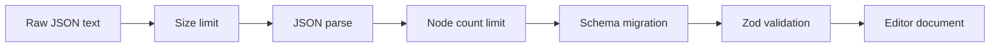
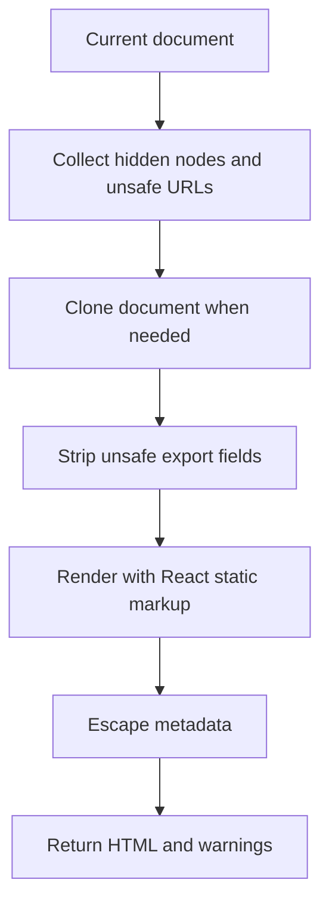

# Security

This project is a client-side page builder, not a general-purpose HTML CMS. The security model is based on strict document shape, URL validation, style allowlists, and sanitized export.

The safest way to describe the guarantee is: imported documents and exported HTML pass through explicit safety boundaries. Do not describe this as complete protection against every possible browser security issue.

## No Arbitrary HTML Rendering

The MVP avoids arbitrary HTML blocks. Text content is stored as structured rich text segments, not as raw HTML strings. The renderer outputs React elements rather than injecting user-provided HTML into the page.

This reduces the risk of user content becoming executable markup.

## Runtime Schema Validation

`src/editor-core/schema.ts` defines strict Zod schemas for documents, nodes, props, constraints, styles, and themes.

Strict validation helps with:

- Rejecting unknown node types.
- Rejecting unexpected fields.
- Enforcing prop shapes.
- Keeping persisted/imported JSON aligned with TypeScript types.

## Import Guardrails

`src/persistence/parseDocument.ts` rejects dangerous or unsupported input before replacing the current document:

- Oversized JSON text.
- Invalid JSON.
- Excessive node counts.
- Future schema versions.
- Documents that fail migration or schema validation.

## URL Safety

URL-like fields are validated in editor-core and sanitized during export.

Relevant URL-like fields include:

- Image source.
- Image link.
- Button href.
- Inline text links.
- Form action.
- Video URL.
- Embed URL.
- Metadata image, favicon, and canonical URL.

Unsafe protocols such as `javascript:`, `vbscript:`, and `data:` are rejected by default. Embed URLs are additionally restricted to allowed domains through media utilities.

## Export Sanitization

`src/export/sanitize.ts` creates a sanitized export document:

- Unsafe image URLs are blanked.
- Unsafe button links are blanked.
- Unsafe form actions are blanked.
- Unsafe text links are removed.
- Unsafe video and embed URLs are blanked.
- Hidden nodes are reported as excluded from export.

`src/export/html.tsx` also escapes metadata and strips unsafe custom head snippet content such as script tags and inline event handlers.

## Style Allowlist

Only known style properties from `StyleProps` are accepted. The allowlist is defined in `src/editor-core/style.ts`.

This prevents imported documents or UI code from passing arbitrary style objects through the renderer.

## Metadata Safety

HTML export escapes:

- Page title.
- Description.
- Open Graph title and description.
- Open Graph image.
- Favicon URL.
- Canonical URL.
- Language value.

The export code also validates URL metadata and falls back to safe defaults where needed.

## What This Does Not Claim

The app does not claim that:

- LocalStorage is encrypted.
- Exported static HTML is a complete CSP-protected deployment.
- User-provided remote assets are trusted.
- Every future browser parsing edge case is covered.
- Collaboration or authentication security exists.

Those are outside the current offline-first client-only scope.

## Tests To Read

- `src/export/export.test.ts`
- `src/persistence/parseDocument.test.ts`
- `src/editor-core/validationUtils.test.ts`
- `src/editor-core/style.test.ts`
- `e2e/export.spec.ts`
