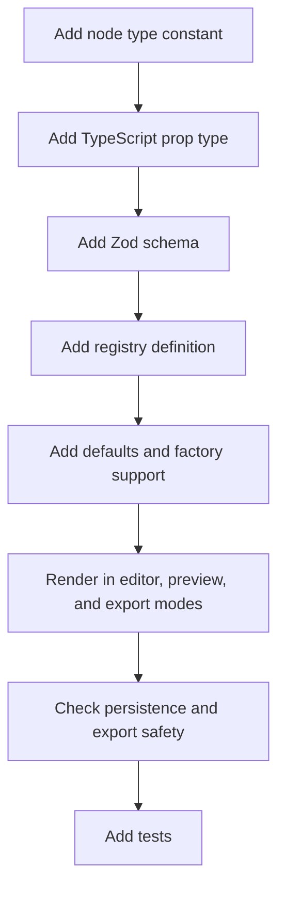

# Extending Blocks

This guide explains how to add or change a block type safely.

The important rule: a block is not only a React component. It is a document type, schema entry, registry entry, default value, inspector configuration, renderer case, command target, import/export concern, and test subject.

## Extension Checklist

## Step 1: Add The Node Type

Update `src/editor-core/constants.ts`.

Add the new type to `NODE_TYPES`. This makes it part of the supported public document model.

Do not add a node type casually. Once exported in JSON, it becomes part of the document compatibility surface.

## Step 2: Add Props

Update `src/editor-core/types.ts`.

Add:

- A prop type for the new node.
- An entry in `NodePropsByType`.
- Any related helper types.

Keep props serializable. The document should remain JSON-safe.

## Step 3: Add Runtime Schema

Update `src/editor-core/schema.ts`.

Add a strict Zod schema for the new props and include it in `NodeSchema`.

The schema should reject unknown fields. Imported documents should not be able to smuggle extra behavior through a block.

## Step 4: Add Registry Metadata

Update `src/editor-core/registry.ts`.

Add:

- `label`
- `defaultProps`
- `allowedChildren`
- `constraints`, if needed
- `inspector` groups and fields
- `validate`, if the block has specific rules

The registry controls both authoring behavior and structural validity.

## Step 5: Add Defaults

Update default creation paths such as:

- `src/editor-core/defaults.ts`
- `src/editor-core/nodeFactory.ts`

Defaults should produce a valid node with usable placeholder content.

## Step 6: Render The Block

Update `src/renderer/RenderDocument.tsx`.

The renderer should support:

- Editor mode.
- Preview mode.
- Export mode.

If the block has different editor-only controls, keep those controls out of export mode.

## Step 7: Consider Drag And Drop Rules

Most blocks inherit structural rules from the registry. If the new block has special drop behavior, update:

- `src/dnd/canDrop.ts`
- `src/dnd/computeIntent.ts`, if pointer/index behavior changes
- Related tests in `src/dnd/`

## Step 8: Consider Import, Export, And Security

If the block has URL-like props, update:

- `src/editor-core/validationUtils.ts`, if shared helper logic is needed.
- `src/export/sanitize.ts`, to strip unsafe export values.
- `src/export/export.test.ts`, to prove the unsafe case.

If the block has embed-like behavior, consider whether it needs a domain allowlist.

If the block has styling behavior, use existing `StyleProps` rather than arbitrary style objects.

## Step 9: Add Tests

Minimum test coverage:

- Registry/default validation.
- Command insertion.
- Renderer output.
- Import validation.
- Export behavior if the block affects output.

Add E2E tests when the new block has a user workflow that can fail only in the browser, such as drag/drop, file interaction, form behavior, or media embedding.

## Example: URL-Like Block Rule

If a new block has a `url` prop, it should not be treated as a plain string everywhere.

The implementation should answer:

- Is the URL required?
- Which protocols are allowed?
- Are relative URLs allowed?
- Is the domain restricted?
- What happens during import?
- What happens during HTML export?
- What warning does the user see if export strips it?

## Public Documentation Update

When adding a new public block type, update:

- [Feature Tour](./02-feature-tour.md), if it changes user-facing capabilities.
- [Data Model](./04-data-model.md), if the supported node list changes.
- [Security](./08-security.md), if the block introduces URL, HTML, script, style, or embed behavior.
- [Testing And Quality](./09-testing-quality.md), if new test categories are added.
