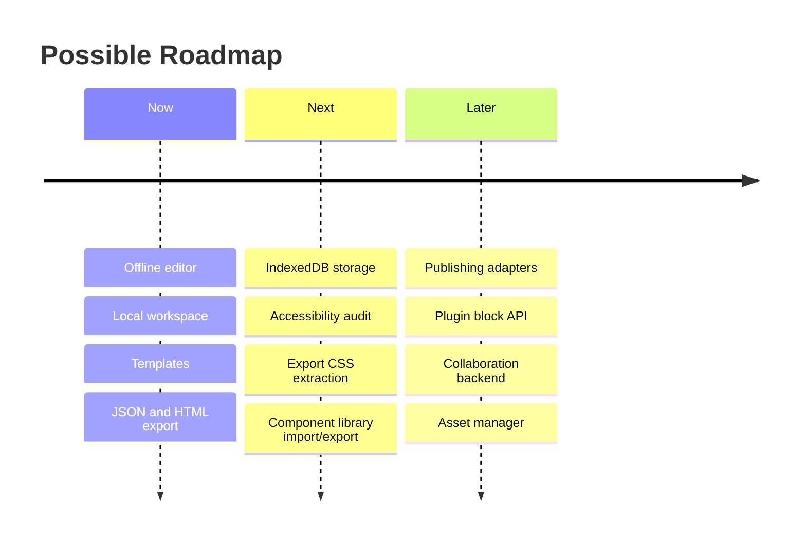

# Limitations And Roadmap

This page documents current boundaries honestly. The project is designed as an offline-first client-side page builder, so some constraints are intentional rather than missing implementation.

## Current Scope

Implemented scope:

- Client-only editing.
- Local workspace persistence.
- Template-based document creation.
- Block palette and canvas editing.
- Drag and drop insertion and movement.
- Inspector-based prop and style editing.
- Layer tree navigation.
- Component library.
- Design token editing.
- Preview mode.
- JSON import/export.
- Sanitized static HTML export.
- Unit, integration, and E2E test coverage.

## Product Limitations

| Area              | Current limitation                            | Why it is acceptable now                                | Future improvement                                 |
| ----------------- | --------------------------------------------- | ------------------------------------------------------- | -------------------------------------------------- |
| Publishing        | Export is local; there is no hosting workflow | Keeps the app backend-free and portable                 | Add optional publishing adapters                   |
| Collaboration     | Single-user editing only                      | Offline-first scope avoids identity and sync complexity | Add shared document backend and conflict handling  |
| Asset management  | Images are URL-based                          | Avoids file storage and upload infrastructure           | Add asset library with IndexedDB or remote storage |
| Templates         | Fixed built-in templates                      | Keeps template generation deterministic                 | Add user-created template management               |
| Component library | Stored locally                                | Works offline and avoids account requirements           | Add import/export for component libraries          |

## Technical Limitations

| Area             | Current limitation                                 | Future improvement                                         |
| ---------------- | -------------------------------------------------- | ---------------------------------------------------------- |
| Storage          | LocalStorage has size limits                       | Move larger documents and assets to IndexedDB              |
| Export CSS       | HTML export uses inline/style-variable approach    | Extract reusable CSS classes for cleaner output            |
| Schema evolution | Migration path exists but version history is small | Add migration test matrix as versions grow                 |
| Performance      | Large documents are bounded by import node limits  | Add virtualization for very large layer trees and canvases |
| Plugin model     | Node types are compiled into the app               | Design explicit plugin API for third-party blocks          |

## Security Boundaries

The app validates and sanitizes known document fields, but it is not a full hosting security platform.

Known boundaries:

- LocalStorage is not encrypted.
- Remote asset URLs are not controlled by the app.
- Exported HTML should still be hosted with normal static-site security practices.
- The app does not implement authentication, authorization, or multi-user isolation.

## Accessibility Opportunities

Current accessibility-related strengths:

- Keyboard shortcuts exist for common editor operations.
- Dialogs and controls use semantic UI patterns in the React layer.
- Preview mode separates editing chrome from rendered content.

Future accessibility work:

- Run a full screen reader audit.
- Add automated accessibility checks to E2E tests.
- Improve drag and drop keyboard alternatives.
- Add better focus restoration after complex panel/dialog flows.
- Improve announcements for validation and export warnings.

## Roadmap

## Engineering Trade-Offs

### Client-only persistence

The project uses browser storage because the goal is an offline-first editor. That keeps setup simple and makes demos reliable without backend dependencies. The trade-off is storage capacity and no cross-device sync.

### Structured blocks over arbitrary HTML

The editor uses typed blocks instead of arbitrary HTML injection. This makes validation, editing, and export safer. The trade-off is less raw flexibility for advanced users.

### Command pipeline over direct mutation

The command layer adds structure and some upfront code. The benefit is predictable mutation, centralized validation, and robust undo/redo.

### Static export over live publishing

Static export is portable and reviewable. The trade-off is that deployment, asset hosting, analytics, and form submission remain outside the core app.
