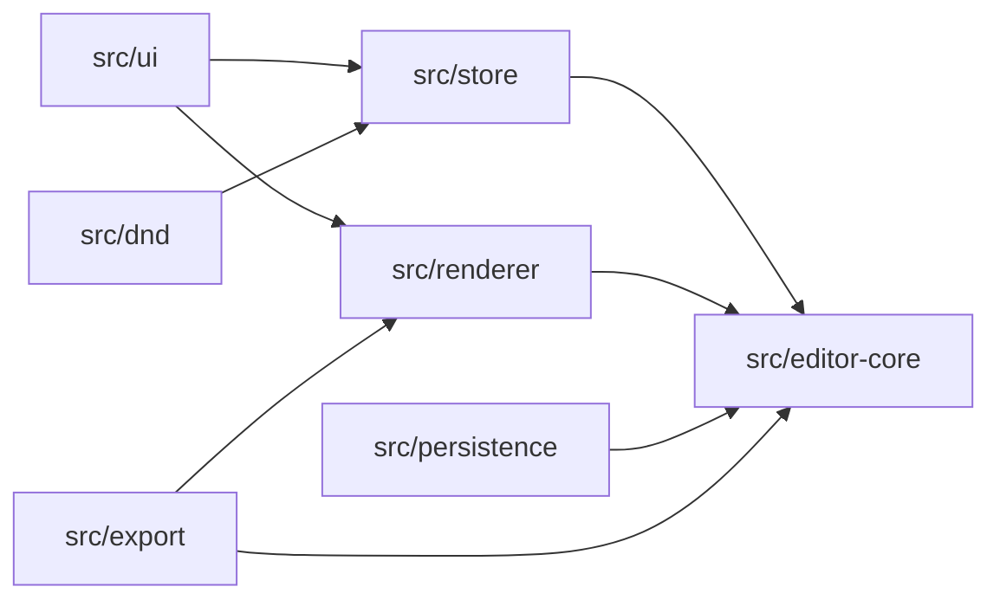

# Reviewer Guide

This guide is for a hiring manager, peer reviewer, or instructor who wants to evaluate the project efficiently.

## Fast Product Review

1. Run `npm install`.
2. Run `npm run dev`.
3. Open the Vite URL.
4. Create a page from the template gallery.
5. Drag a block from the palette into the canvas.
6. Select a block and edit it in the inspector.
7. Switch to preview mode.
8. Save, reload, and verify persistence.
9. Export HTML and open the generated file.

Relevant screenshots:

- [Workspace dashboard](./assets/screenshots/workspace-dashboard-empty.png)
- [Template gallery](./assets/screenshots/template-gallery.png)
- [Main editor](./assets/screenshots/editor-main-empty-page.png)
- [Exported HTML](./assets/screenshots/exported-html-page.png)

## Fast Technical Review

Read these files first:

| Question                      | File                                               |
| ----------------------------- | -------------------------------------------------- |
| What is a document?           | `src/editor-core/types.ts`                         |
| What node types exist?        | `src/editor-core/constants.ts`                     |
| What children are allowed?    | `src/editor-core/registry.ts`                      |
| How do mutations work?        | `src/editor-core/commands.ts`                      |
| How does undo/redo work?      | `src/store/editorStore.ts`                         |
| How does the document render? | `src/renderer/RenderDocument.tsx`                  |
| How is drag/drop calculated?  | `src/dnd/computeIntent.ts`                         |
| How is import parsed?         | `src/persistence/parseDocument.ts`                 |
| How is HTML export sanitized? | `src/export/sanitize.ts` and `src/export/html.tsx` |

## Architecture In One Diagram



The most important review point: `src/editor-core/` owns the model and rules. React UI is not the source of truth for document validity.

## What To Look For

Strong signals:

- The document model is typed and schema-validated.
- Runtime validation and TypeScript types are aligned.
- Document mutations flow through a command pipeline.
- Undo/redo uses patches instead of scattered snapshot logic.
- DnD computes a drop intent but still relies on command validation.
- HTML export has a sanitizer and warning path.
- Tests exist at multiple layers.

Potential questions:

- How would this scale beyond LocalStorage?
- How should schema migrations evolve as more document versions exist?
- What accessibility work remains for drag/drop and inspector workflows?
- How should asset upload and hosting be handled outside the current offline-first scope?

## Verification Commands

```bash
npm run typecheck
npm run lint
npm run test:run
npm run build
```

For browser-level workflow verification:

```bash
npm run test:e2e
```

## Best Test Files To Inspect

| Area          | Files                                                      |
| ------------- | ---------------------------------------------------------- |
| Commands      | `src/editor-core/commands.test.ts`                         |
| Store/history | `src/store/editorStore.test.ts`                            |
| DnD           | `src/dnd/canDrop.test.ts`, `src/dnd/computeIntent.test.ts` |
| Export        | `src/export/export.test.ts`, `e2e/export.spec.ts`          |
| Persistence   | `src/persistence/*.test.ts`, `e2e/persistence.spec.ts`     |
| UI workflows  | `e2e/*.spec.ts`                                            |

## Demo Script

Use this deterministic demo:

1. Open the workspace dashboard.
2. Click create page.
3. Choose the landing page template.
4. Select the hero image.
5. Change the image source and alt text.
6. Select the primary button.
7. Change appearance or spacing.
8. Toggle preview mode.
9. Open export and download HTML.
10. Open the exported page in the browser.

The demo shows the full loop: template creation, structured editing, responsive preview, local save, and sanitized export.
